---
## Front matter
title: "Отчёт по лабораторной работе №1"
subtitle: "Установка и конфигурация операционной системы на виртуальную машину"
author: "Аскеров Александр Эдуардович"

## Generic otions
lang: ru-RU
toc-title: "Содержание"

## Bibliography
bibliography: bib/cite.bib
csl: pandoc/csl/gost-r-7-0-5-2008-numeric.csl

## Pdf output format
toc: true # Table of contents
toc-depth: 2
lof: true # List of figures
lot: false # List of tables
fontsize: 12pt
linestretch: 1.5
papersize: a4
documentclass: scrreprt
## I18n polyglossia
polyglossia-lang:
  name: russian
  options:
	- spelling=modern
	- babelshorthands=true
polyglossia-otherlangs:
  name: english
## I18n babel
babel-lang: russian
babel-otherlangs: english
## Fonts
mainfont: PT Serif
romanfont: PT Serif
sansfont: PT Sans
monofont: PT Mono
mainfontoptions: Ligatures=TeX
romanfontoptions: Ligatures=TeX
sansfontoptions: Ligatures=TeX,Scale=MatchLowercase
monofontoptions: Scale=MatchLowercase,Scale=0.9
## Biblatex
biblatex: true
biblio-style: "gost-numeric"
biblatexoptions:
  - parentracker=true
  - backend=biber
  - hyperref=auto
  - language=auto
  - autolang=other*
  - citestyle=gost-numeric
## Pandoc-crossref LaTeX customization
figureTitle: "Рис."
tableTitle: "Таблица"
listingTitle: "Листинг"
lofTitle: "Список иллюстраций"
lotTitle: "Список таблиц"
lolTitle: "Листинги"
## Misc options
indent: true
header-includes:
  - \usepackage{indentfirst}
  - \usepackage{float} # keep figures where there are in the text
  - \floatplacement{figure}{H} # keep figures where there are in the text
---

# Цель работы

Целью данной работы является приобретение практических навыков установки операционной системы на виртуальную машину, настройки минимально необходимых для дальнейшей работы сервисов.

# Выполнение лабораторной работы

## Создание виртуальной машины

Создадим виртуальную машину.

Укажем её имя и тип.

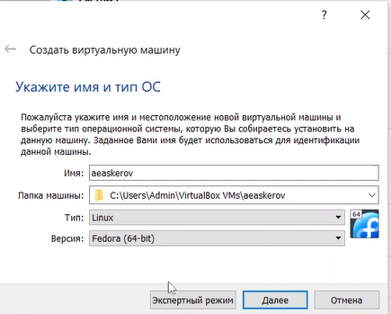{ #fig:1 }

Укажем объём памяти ВМ.

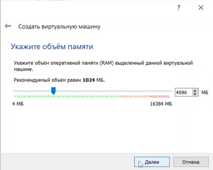{ #fig:2 }

Создадим новый виртуальный жёсткий диск.

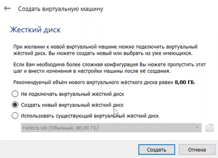{ #fig:3 }

Укажем тип виртуального жёсткого диска.

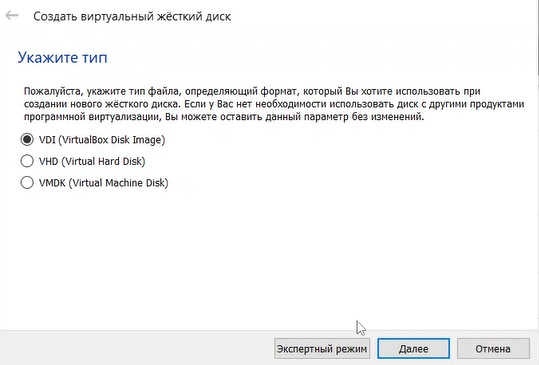{ #fig:4 }

Укажем имя виртуального жёсткого диска и максимальный размер файловых данных, хранимых на этом диске.

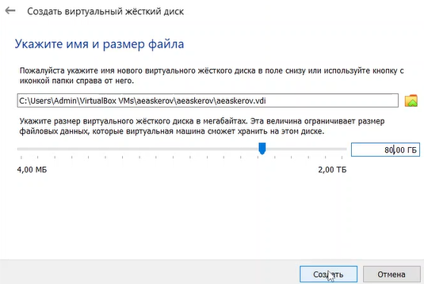{ #fig:5 }

Добавим виртуальный оптический привод Fedora i3.

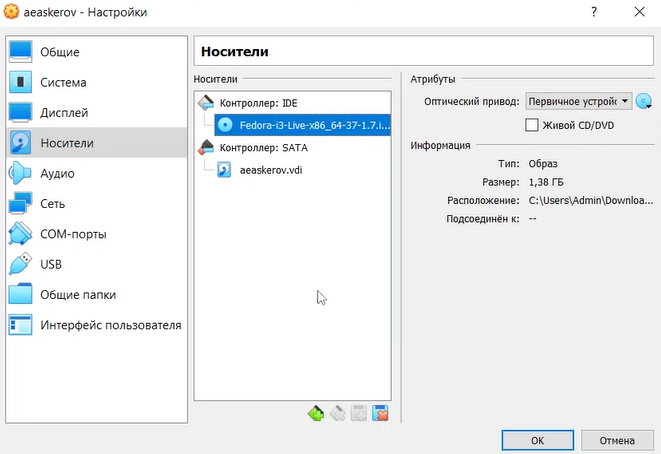{ #fig:6 }

## Установка операционной системы

Выберем в качестве модификатора клавишу Win (она же клавиша Super).

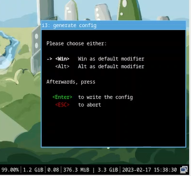{ #fig:7 }

Включим терминал и запустим установку Liveinst.

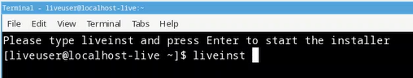{ #fig:8 }

В открывшемся «обзоре установки» проведём настройку.

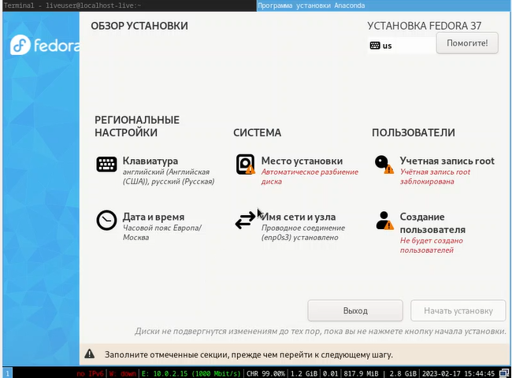{ #fig:9 }

Выберем место установки. Включим автоматическое разбиение диска.

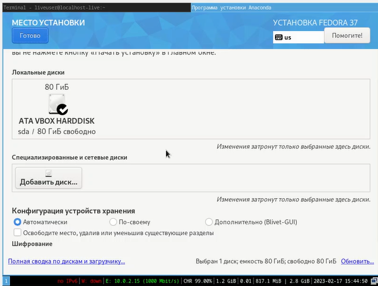{ #fig:10 }

Установим имя узла.

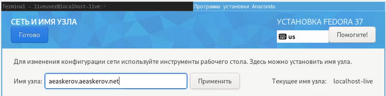{ #fig:11 }

Установим учётную запись root.

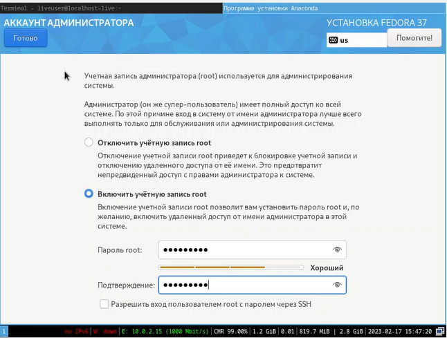{ #fig:12 }

### Обновления

Обновим все пакеты.

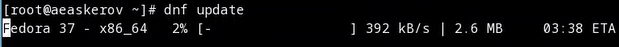{ #fig:13 }

### Повышение комфорта работы

Установим программы (tmux и MidnightCommander) для удобства работы в консоли.

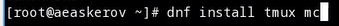{ #fig:14 }

### Автоматическое обновление системы

Установим автоматическое обновление системы.

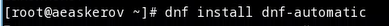{ #fig:15 }

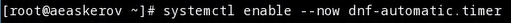{ #fig:16 }

### SElinux

Откроем файл config. Найдём строчку SELinux=enforcing, и заменим enforcing на permissive.

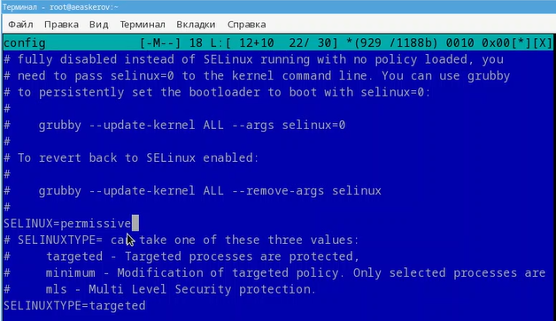{ #fig:17 }

## Установка драйверов VirtualBox

Установим пакет dkms.

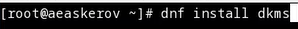{ #fig:18 }

Подключим образ диска Дополнительной гостевой ОС.

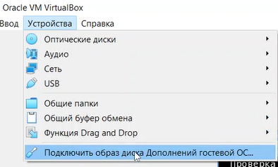{ #fig:19 }

Подмонтируем диск.

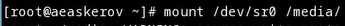{ #fig:20 }

Установим драйвера.

{ #fig:21 }

Перезагрузим устройство.

{ #fig:22 }

## Установка раскладки клавиатуры

Переключимся на суперпользователя и отредактируем следующий конфигурационный файл: /etc/X11/xorg.conf.d/00-keyboard.conf. После чего перезагрузим устройство.

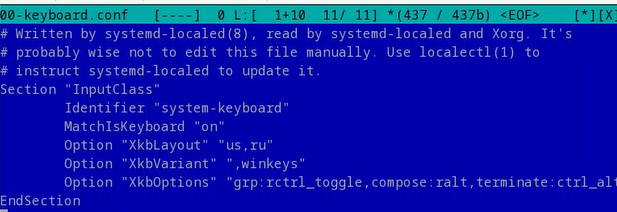{ #fig:23 }

## Установка имени пользователя и названия хоста

Так как эти параметры изначально установлены верно, просто выведем их описание для просмотра.

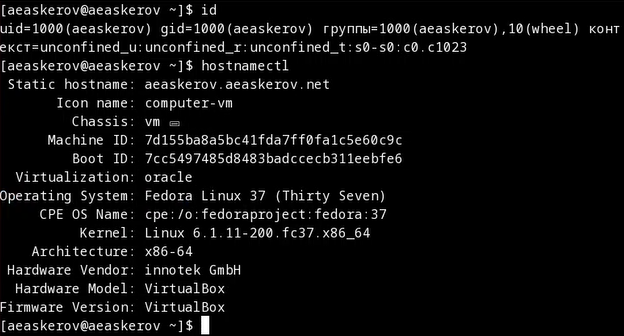{ #fig:24 }

## Установка программного обеспечения для создания докуметации

Установим pandoc.

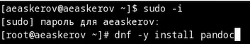{ #fig:25 }

Установим TeXlive.

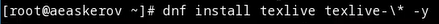{ #fig:26 }

После того как установка завершилась, проверим наличие необходимых инструментов.

Во-первых, luatex.

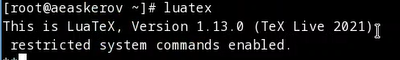{ #fig:27 }

Во-вторых, pdflatex.

{ #fig:28 }

И, в-третьих, xelatex.

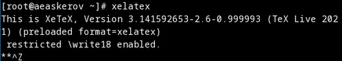{ #fig:29 }

## Домашнее задание

Проанализируем последовательность загрузки системы, выполнив команду dmesg | less.

{ #fig:30 }

Получим следующую информацию.

Версия ядра Linux (Linux version).

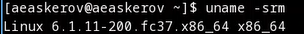{ #fig:31 }

Частота процессора (Detected Mhz processor).

{ #fig:32 }

Модель процессора (CPU0).

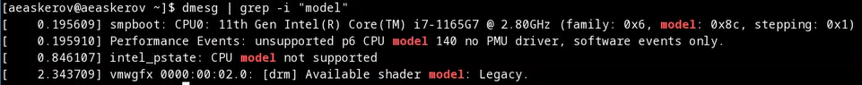{ #fig:33 }

Объём доступной оперативной памяти (Memory available).

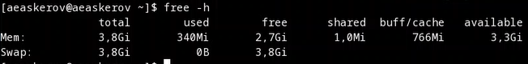{ #fig:34 }

Тип обнаруженного гипервизора (Hypervisor detected).

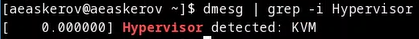{ #fig:35 }

Тип файловой системы корневого раздела.

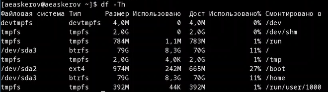{ #fig:36 }

Последовательность монтирования файловых систем.

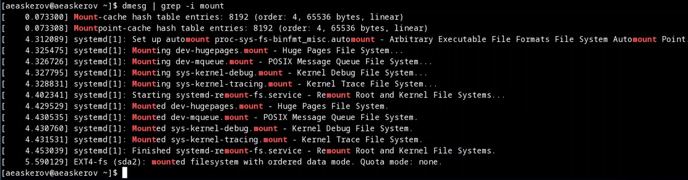{ #fig:37 }

## Контрольные вопросы

1) Логин и пароль

2)

* -h или -help. Пример: wget –help или wget -h.

* cd. Пример: cd /Gallery.

* ls. Пример: ls /Gallery.

* du. Пример: sudo du -h /Gallery.

* Создать файл touch. Пример: touch ~/newdir/dir1/dir2/test.txt

* Создать каталог mkdir. Пример: mkdir ~/dir/newdir

* Удалить файл rm. Пример: rm ~/newdir/test.txt

* Удалить каталог rm -r. Пример: rm -r ~/dir/newdir

* chmod. Пример: chmod g-w file.txt

* history. Пример: history

3) Файловая система - способ организации, хранения и именования данных на носителях информации. Примеры: Ext2, Ext3, Ext4 (Extended Filesystem) - стандартная файловая система для Linux. FAT32 (от англ. File Allocation Table — «таблица размещения файлов») — файловая система, разработанная компанией Microsoft, разновидность FAT. NTFS (аббревиатура от англ. new technology file system — «файловая система новой технологии») — стандартная файловая система для семейства операционных систем Windows.

4) Команда findmnt для просмотра смонтированных файловых систем в Linux.

5) Команда kill принимает в качестве параметра PID процесса. Пример: kill (PID процесса)

# Выводы

Приобретены практические навыки установки операционной системы на виртуальную машину, настройки минимально необходимых для дальнейшей работы сервисов.
