---
## Front matter
lang: ru-RU
title: Презентация №4
subtitle: Основы интерфейса взаимодействия пользователя с системой Unix на уровне командной строки
author:
  - Аскеров А.Э.
institute:
  - Российский университет дружбы народов, Москва, Россия
date: 27 февраля 2023

## i18n babel
babel-lang: russian
babel-otherlangs: english

## Formatting pdf
toc: false
toc-title: Содержание
slide_level: 2
aspectratio: 169
section-titles: true
theme: metropolis
header-includes:
 - \metroset{progressbar=frametitle,sectionpage=progressbar,numbering=fraction}
 - '\makeatletter'
 - '\beamer@ignorenonframefalse'
 - '\makeatother'
---

# Вступление

## Цель работы

Приобрести практические навыки взаимодействия пользователя с системой
посредством командной строки.

# Теоретическое введение

Рассмотрим команды для работы с терминалом.

Команда man. Команда man используется для просмотра (оперативная помощь)
в диалоговом режиме руководства (manual) по основным командам операционной системы типа Linux.

Команда cd. Команда cd используется для перемещения по файловой системе
операционной системы типа Linux.

Команда pwd. Для определения абсолютного пути к текущему каталогу используется команда pwd (print working directory).

Команда ls. Команда ls используется для просмотра содержимого каталога.

## Теоретическое введение

Команда mkdir. Команда mkdir используется для создания каталогов.

Команда rm. Команда rm используется для удаления файлов и/или каталогов.
Если каталог пуст, то можно воспользоваться командой rmdir. Если удаляемый
каталог содержит файлы, то команда не будет выполнена — нужно использовать
rm - r имя_каталога.

Команда history. Для вывода на экран списка ранее выполненных команд используется команда history. Выводимые на экран команды в списке нумеруются.
К любой команде из выведенного на экран списка можно обратиться по её номеру
в списке, воспользовавшись конструкцией !\<номер команды\>.

Использование символа «;». Если требуется выполнить последовательно
несколько команд, записанных в одной строке, то для этого используется символ
точка с запятой.

# Выполнение лабораторной работы

## Задания 1 и 2

1. Определим полное имя домашнего каталога

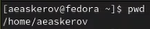{ width=30% }

2.1. Перейдём в каталог /tmp

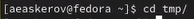{ width=35% }

## Задания 1 и 2

2.2. Выведем на экран содержимое каталога /tmp различными способами с помощью команды ls

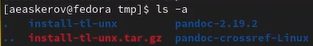{ width=30% }

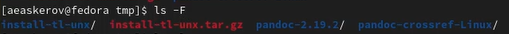{ width=60% }

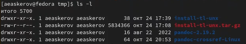{ width=50% }

## Задания 1 и 2

2.3. Посмотрим, есть ли в каталоге /var/spool подкаталог с именем cron?

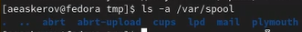{ width=34% }

2.4. Перейдём в домашний каталог и выведем на экран его содержимое. Определим, кто является владельцем файлов и подкаталогов.

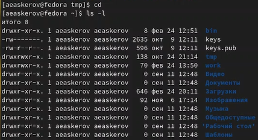{ width=36% }

Из скриншота видно, что владельцем файлов и подкаталогов является aeaskerov.

## Задание 3

3.1. В домашнем каталоге создадим новый каталог с именем newdir.

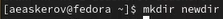{ width=40% }

3.2. В каталоге ~/newdir создадим новый каталог с именем morefun.

{ width=45% }

## Задание 3

3.3. В домашнем каталоге создадим одной командой три новых каталога с именами letters, memos, misk. Затем удалим эти каталоги одной командой.

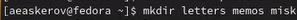{ width=45% }

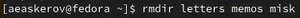{ width=45% }

## Задание 3

3.4. Попробуем удалить ранее созданный каталог ~/newdir командой rm. Проверим, был ли каталог удалён.

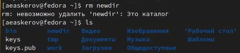{ width=42% }

Как видно, каталог не был удалён.

## Задание 3

3.5. Удалим каталог ~/newdir/morefun из домашнего каталога. Проверим, был ли каталог удалён.

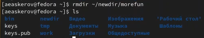{ width=45% }

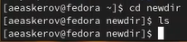{ width=35% }

## Задание 4

4. С помощью команды man определим, какую опцию команды ls нужно использовать для просмотра содержимого не только указанного каталога, но и подкаталогов, входящих в него.

Выполнив команду man ls и прокрутив вниз список аргументов, мы находим нужный – -R.

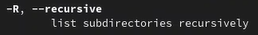{ width=45% }

## Задание 5

5. С помощью команды man определим набор опций команды ls, позволяющий отсортировать по времени последнего изменения выводимый список содержимого каталога с развёрнутым описанием файлов.

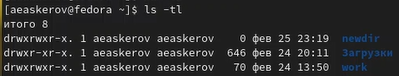{ width=45% }

## Задание 6

6. Используем команду man для просмотра описания следующих команд: ***cd, pwd, mkdir, rmdir, rm***. Поясним их основные опции.

Основными опциями команды ***cd*** являются аргументы –L и –P (с аргументом –P также можно указать аргумент –e). -P – позволяет следовать по символическим ссылкам перед тем, как будут обработаны все переходы ".."; -L – переходит по символическим ссылкам только после того, как были обработаны ".."; -e – если папку, в которую нужно перейти не удалось найти – выдаёт ошибку.

Основными опциями команды ***pwd*** являются аргументы –L, --logical, –P, --help, --version. -L, --logical - брать директорию из переменной окружения, даже если она содержит символические ссылки; -P - отбрасывать все символические ссылки; --help - отобразить справку по утилите; --version - отобразить версию утилиты.

## Задание 6

Основными опциями команды ***mkdir*** являются аргументы –m, --mode=MODE, –p, --parents, -v, --verbose, -Z, --context[=CTX], --help, --version. -m или --mode=MODE – устанавливает права доступа для создаваемой директории; -p или –parents – создать все директории, которые указаны внутри пути (если какая-либо директория существует, то предупреждение об этом не выводится); -v или –verbose – выводить сообщение о каждой создаваемой директории; -Z – установить контекст SELinux для создаваемой директории по умолчанию; --context[=CTX] – установить контекст SELinux для создаваемой директории в значение CTX; --help – оказать справку по команде mkdir; --version – показать версию утилиты mkdir.

## Задание 6

Основными опциями команды ***rmdir*** являются аргументы –ignore-fail-on-non-empty, -p, --parents, -v, --verbose, --help, --version. –ignore-fail-on-non-empty – игнорировать ошибки, вызванные тем, что директория не пустая; -p, --parents – удалить директорию и все её дочерние элементы; -v, --verbose – выводить диагностику для каждой обработанной директории; --help – оказать справку по команде rmdir; --version – показать версию утилиты rmdir.

## Задание 6

Основными опциями команды ***rm*** являются аргументы –f, --force, -I, -I, --interactive[=WHEN], --one-file-system, --no-preserve-root, --preserve-root[=all], -r, -R, --recursive, -d, --dir, -v, --verbose, --help, --version. -f или --force - игнорировать несуществующие файлы и аргументы, никогда не выдавать запросы на подтверждение удаления; -i - выводить запрос на подтверждение удаления каждого файла; -I - выдать один запрос на подтверждение удаления всех файлов, если удаляется больше трех файлов или используется рекурсивное удаление; -r, -R или --recursive - удаление директорий и их содержимого (рекурсивное удаление); -d или --dir - удалять пустые директории; -v или --verbose - выводить информацию об удаляемых файлах.

## Задание 7

7. Используя информацию, полученную при помощи команды history, выполним модификацию и исполнение нескольких команд из буфера команд.

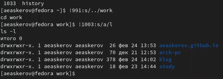{ width=50% }

# Вывод

Приобретены практические навыки взаимодействия пользователя с системой посредством командной строки.
