---
## Front matter
title: "Отчёт по лабораторной работе №4"
subtitle: "Основы интерфейса взаимодействия пользователя с системой Unix на уровне командной строки"
author: "Аскеров Александр Эдуардович"

## Generic otions
lang: ru-RU
toc-title: "Содержание"

## Bibliography
bibliography: bib/cite.bib
csl: pandoc/csl/gost-r-7-0-5-2008-numeric.csl

## Pdf output format
toc: true # Table of contents
toc-depth: 2
lof: true # List of figures
lot: false # List of tables
fontsize: 12pt
linestretch: 1.5
papersize: a4
documentclass: scrreprt
## I18n polyglossia
polyglossia-lang:
  name: russian
  options:
	- spelling=modern
	- babelshorthands=true
polyglossia-otherlangs:
  name: english
## I18n babel
babel-lang: russian
babel-otherlangs: english
## Fonts
mainfont: PT Serif
romanfont: PT Serif
sansfont: PT Sans
monofont: PT Mono
mainfontoptions: Ligatures=TeX
romanfontoptions: Ligatures=TeX
sansfontoptions: Ligatures=TeX,Scale=MatchLowercase
monofontoptions: Scale=MatchLowercase,Scale=0.9
## Biblatex
biblatex: true
biblio-style: "gost-numeric"
biblatexoptions:
  - parentracker=true
  - backend=biber
  - hyperref=auto
  - language=auto
  - autolang=other*
  - citestyle=gost-numeric
## Pandoc-crossref LaTeX customization
figureTitle: "Рис."
tableTitle: "Таблица"
listingTitle: "Листинг"
lofTitle: "Список иллюстраций"
lotTitle: "Список таблиц"
lolTitle: "Листинги"
## Misc options
indent: true
header-includes:
  - \usepackage{indentfirst}
  - \usepackage{float} # keep figures where there are in the text
  - \floatplacement{figure}{H} # keep figures where there are in the text
---

# Цель работы

Приобрести практические навыки взаимодействия пользователя с системой посредством командной строки.

# Теоретическое введение

Рассмотрим команды для работы с терминалом.

Команда man. Команда man используется для просмотра (оперативная помощь) в диалоговом режиме руководства (manual) по основным командам операционной системы типа Linux.

Команда cd. Команда cd используется для перемещения по файловой системе операционной системы типа Linux.

Команда pwd. Для определения абсолютного пути к текущему каталогу используется 
команда pwd (print working directory).

Команда ls. Команда ls используется для просмотра содержимого каталога

Команда mkdir. Команда mkdir используется для создания каталогов.

Команда rm. Команда rm используется для удаления файлов и/или каталогов. Если каталог пуст, то можно воспользоваться командой rmdir. Если удаляемый каталог содержит файлы, то команда не будет выполнена — нужно использовать rm - r имя_каталога.

Команда history. Для вывода на экран списка ранее выполненных команд используется команда history. Выводимые на экран команды в списке нумеруются. К любой команде из выведенного на экран списка можно обратиться по её номеру в списке, воспользовавшись конструкцией !<Номер команды>.

Использование символа «;». Если требуется выполнить последовательно несколько команд, записанных в одной строке, то для этого используется символ точка с запятой.

# Выполнение лабораторной работы

1. Определим полное имя домашнего каталога. Далее относительно этого каталога будут выполняться последующие упражнения.

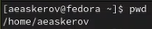{ #fig:1 }

2. Выполним следующие действия:

    2.1. Перейдём в каталог /tmp.

    { #fig:2 }

    2.2. Выведем на экран содержимое каталога /tmp. Для этого используем команду ls с различными опциями.

    Используя аргумент –a, мы выводим на экран все каталоги и файлы, включая скрытые.

    { #fig:3 }

    Используя аргумент –F, мы выводим на экран информацию о типах файлов и каталогов.

    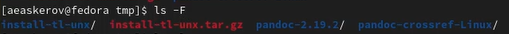{ #fig:4 }

    Используя аргумент –l, мы выводим на экран подробную информацию о типах файлов и каталогов (тип файла, право доступа, число ссылок, владелец, размер, дата последней ревизии, имя файла или каталога).

    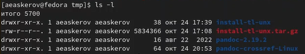{ #fig:5 }

    2.3. Определим, есть ли в каталоге /var/spool подкаталог с именем cron?

    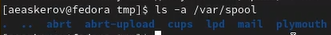{ #fig:6 }

    2.4. Перейдём в домашний каталог и выведем на экран его содержимое. Определим, кто является владельцем файлов и подкаталогов.

    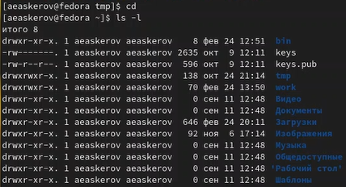{ #fig:7 }

    Из скриншота видно, что владельцем файлов и подкаталогов является aeaskerov.

3. Выполним следующие действия:

    3.1. В домашнем каталоге создадим новый каталог с именем newdir.

    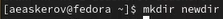{ #fig:8 }

    3.2. В каталоге ~/newdir создадим новый каталог с именем morefun.

    { #fig:9 }

    3.3. В домашнем каталоге создадим одной командой три новых каталога с именами letters, memos, misk. Затем удалим эти каталоги одной командой.

    { #fig:10 }

    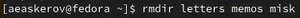{ #fig:11 }

    3.4. Попробуем удалить ранее созданный каталог ~/newdir командой rm. Проверим, был ли каталог удалён.

    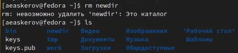{ #fig:12 }

    Как видно, каталог не был удалён.

    3.5. Удалим каталог ~/newdir/morefun из домашнего каталога. Проверим, был ли каталог удалён.

    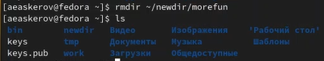{ #fig:13 }

    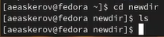{ #fig:14 }

4. С помощью команды man определим, какую опцию команды ls нужно использовать для просмотра содержимого не только указанного каталога, но и подкаталогов, входящих в него.

Выполнив команду man ls и прокрутив вниз список аргументов, мы находим нужный – -R.

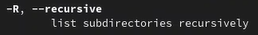{ #fig:15 }

5. С помощью команды man определим набор опций команды ls, позволяющий отсортировать по времени последнего изменения выводимый список содержимого каталога с развёрнутым описанием файлов.

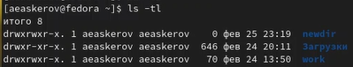{ #fig:16 }

6. Используем команду man для просмотра описания следующих команд: cd, pwd, mkdir, rmdir, rm. Поясним их основные опции.

Основными опциями команды cd являются аргументы –L и –P (с аргументом –P также можно указать аргумент –e). -P – позволяет следовать по символическим ссылкам перед тем, как будут обработаны все переходы ".."; -L – переходит по символическим ссылкам только после того, как были обработаны ".."; -e – если папку, в которую нужно перейти не удалось найти – выдаёт ошибку.

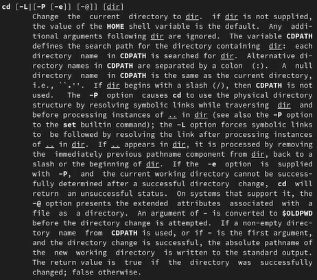{ #fig:17 }

Основными опциями команды pwd являются аргументы –L, --logical, –P, --help, --version. -L, --logical - брать директорию из переменной окружения, даже если она содержит символические ссылки; -P - отбрасывать все символические ссылки; --help - отобразить справку по утилите; --version - отобразить версию утилиты.

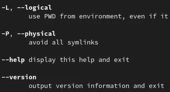{ #fig:18 }

Основными опциями команды mkdir являются аргументы –m, --mode=MODE, –p, --parents, -v, --verbose, -Z, --context[=CTX], --help, --version. -m или --mode=MODE – устанавливает права доступа для создаваемой директории; -p или –parents – создать все директории, которые указаны внутри пути (если какая-либо директория существует, то предупреждение об этом не выводится); -v или –verbose – выводить сообщение о каждой создаваемой директории; -Z – установить контекст SELinux для создаваемой директории по умолчанию; --context[=CTX] – установить контекст SELinux для создаваемой директории в значение CTX; --help – оказать справку по команде mkdir; --version – показать версию утилиты mkdir.

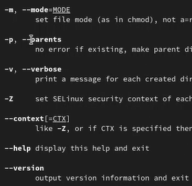{ #fig:19 }

Основными опциями команды rmdir являются аргументы –ignore-fail-on-non-empty, -p, --parents, -v, --verbose, --help, --version. –ignore-fail-on-non-empty – игнорировать ошибки, вызванные тем, что директория не пустая; -p, --parents – удалить директорию и все её дочерние элементы; -v, --verbose – выводить диагностику для каждой обработанной директории; --help – оказать справку по команде rmdir; --version – показать версию утилиты rmdir.

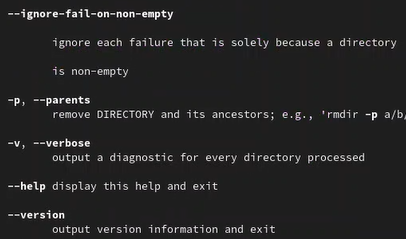{ #fig:20 }

Основными опциями команды rm являются аргументы –f, --force, -I, -I, --interactive[=WHEN], --one-file-system, --no-preserve-root, --preserve-root[=all], -r, -R, --recursive, -d, --dir, -v, --verbose, --help, --version. -f или --force - игнорировать несуществующие файлы и аргументы, никогда не выдавать запросы на подтверждение удаления; -i - выводить запрос на подтверждение удаления каждого файла; -I - выдать один запрос на подтверждение удаления всех файлов, если удаляется больше трех файлов или используется рекурсивное удаление; --interactive[=WHEN] - вместо WHEN можно использовать: never — никогда не выдавать запросы на подтверждение удаления, once — выводить запрос один раз (аналог опции -I), always (по умолчанию) — выводить запрос всегда (аналог опции -i); --one-file-system - во время рекурсивного удаления пропускать директории, которые находятся на других файловых системах; --no-preserve-root - если в качестве директории для удаления задан корневой раздел /, то считать, что это обычная директория и начать выполнять удаление; --preserve-root - если в качестве директории для удаления задан корневой раздел /, то запретить выполнять команду rm над корневым разделом (данное поведение используется по умолчанию); -r, -R или --recursive - удаление директорий и их содержимого (рекурсивное удаление); -d или --dir - удалять пустые директории; -v или --verbose - выводить информацию об удаляемых файлах.

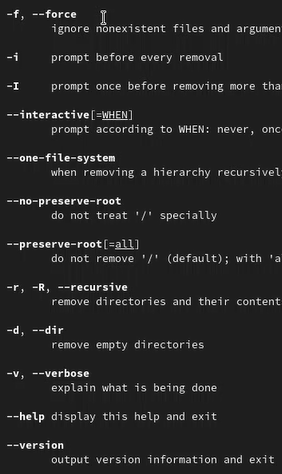{ #fig:21 }

7. Используя информацию, полученную при помощи команды history, выполним модификацию и исполнение нескольких команд из буфера команд.

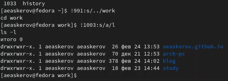{ #fig:22 }

## Контрольные вопросы

1. Что такое командная строка?

Способ взаимодействия между человеком и компьютером путём отправки компьютеру команд, представляющих собой последовательность символов. Команды интерпретируются с помощью специального интерпретатора, называемого оболочкой.

2. При помощи какой команды можно определить абсолютный путь текущего каталога? Приведите пример.

С помощью команды pwd.

{ #fig:23 }

3. При помощи какой команды и каких опций можно определить только тип файлов и их имена в текущем каталоге? Приведите примеры.

С помощью команды ls с аргументом -F.

{ #fig:24 }

4. Каким образом отобразить информацию о скрытых файлах? Приведите примеры.

С помощью команды ls с аргументом -a.

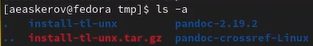{ #fig:25 }

5. При помощи каких команд можно удалить файл и каталог? Можно ли это сделать одной и той же командой? Приведите примеры.

Файл можно удалить с помощью команды rm. Для удаления непустого каталога используется команда rm с аргументом -r. Для удаления пустого каталога используется команда rmdir.

{ #fig:26 }

6. Каким образом можно вывести информацию о последних выполненных пользователем командах?

С помощью команды history.

7. Как воспользоваться историей команд для их модифицированного выполнения? Приведите примеры.

Для модификации команды из истории используется следующая схема: !<номер команды>:s/<то, что меняем>/<то, на что меняем>.

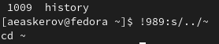{ #fig:27 }

8. Приведите примеры запуска нескольких команд в одной строке.

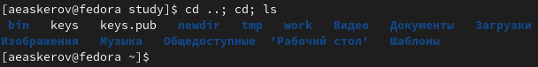{ #fig:28 }

9. Дайте определение и приведите примеры символов экранирования.
Символ экранирования – это символ, который вызывает альтернативную интерпретацию следующих символов в последовательности символов. Этим символом в командной строке является обратный слэш.
Примеры: \\. \\/ \\*

10. Охарактеризуйте вывод информации на экран после выполнения команды ls с опцией l.

При выполнении команды ls -l на экран выводится следующая информация о файлах и директориях:

* Тип файла
* Права доступа
* Число ссылок
* Владелец
* Размер
* Дата последней ревизии
* Имя файла или каталога

11. Что такое относительный путь к файлу? Приведите примеры использования относительного и абсолютного пути при выполнении какой-либо команды.

Относительный путь к файлу – это путь, начинающийся от текущей директории.

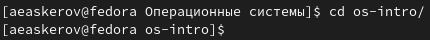{ #fig:29 }

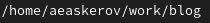{ #fig:30 }

12. Как получить информацию об интересующей вас команде?

С помощью команды man.

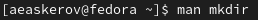{ #fig:31 }

13. Какая клавиша или комбинация клавиш служит для автоматического дополнения вводимых команд?

Клавиша Tab.

# Выводы

Приобретены практические навыки взаимодействия пользователя с системой посредством командной строки.
