---
## Front matter
lang: ru-RU
title: Презентация №5
subtitle: Анализ файловой системы Linux. Команды для работы с файлами и каталогами
author:
  - Аскеров А.Э.
institute:
  - Российский университет дружбы народов, Москва, Россия
date: 11 марта 2023

## i18n babel
babel-lang: russian
babel-otherlangs: english

## Formatting pdf
toc: false
toc-title: Содержание
slide_level: 2
aspectratio: 169
section-titles: true
theme: metropolis
header-includes:
 - \metroset{progressbar=frametitle,sectionpage=progressbar,numbering=fraction}
 - '\makeatletter'
 - '\beamer@ignorenonframefalse'
 - '\makeatother'
---

# Вступление

## Цель работы

Ознакомиться с файловой системой Linux, её структурой, именами и содержанием каталогов. Приобрести практические навыки по применению команд для работы с файлами и каталогами, по управлению процессами (и работами), по проверке использования диска и обслуживанию файловой системы.

# Теоретическое введение

- Команда touch для создания файла.

- Команда cat для просмотра содержимого небольшого файла.

- Команда less для постраничного просмотра.

- Команда head по умолчанию выводит первые 10 строк файла.

- Команда tail по умолчанию выводит последние 10 строк файла.

- Команда cp для копирования файлов и каталогов.

- Команды mv и mvdir предназначены для перемещения и переименования файлов и каталогов.

- Права доступа: read, write, execute, -. Права доступа к файлу или каталогу можно изменить, воспользовавшись командой chmod.

# Выполнение лабораторной работы

## Задание 1

1.1. ***Копирование файла в текущем каталоге.*** Скопируем файл ~/abc1 в файл april и в файл may.

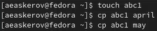{ #fig:1 width=30% }

1.2. ***Копирование нескольких файлов в каталог.*** Скопируем файлы april и may в каталог monthly.

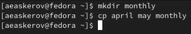{ #fig:2 width=30% }

## Задание 1

1.3. ***Копирование файлов в произвольном каталоге.*** Скопируем файл monthly/may в файл с именем june.

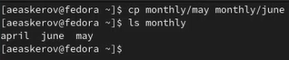{ #fig:3 width=30% }

1.1. ***Копирование каталогов в текущем каталоге.*** Скопируем каталог monthly в каталог monthly.00.

{ #fig:4 width=30%}

## Задание 1

1.2. ***Копирование каталогов в произвольном каталоге.*** Скопируем каталог monthly.00 в каталог /tmp.

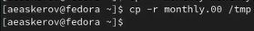{ #fig:5 width=30% }

1.1. ***Переименование файлов в текущем каталоге.*** Изменим название файла april на july в домашнем каталоге.

{ #fig:6 width=30% }

## Задание 1

1.2. ***Перемещение файлов в другой каталог.*** Переместим файл july в каталог monthly.00.

{ #fig:7 width=30% }

1.3. ***Переименование каталогов в текущем каталоге.*** Переименуем каталог monthly.00 в monthly.01.

{ #fig:8 width=30% }

## Задание 1

1.4. ***Перемещение каталога в другой каталог.*** Переместим каталог monthly.01в каталог reports.

{ #fig:9 width=30% }

1.5. ***Переименование каталога, не являющегося текущим.*** Переименуем каталог reports/monthly.01 в reports/monthly.

{ #fig:10 width=40% }

## Задание 1

1.1. ***Права доступа.***

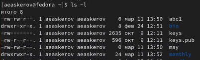{ #fig:11 width=30% }

1.1. Создадим файл ~/may с правом выполнения для владельца.

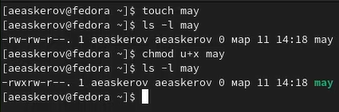{ #fig:12 width=30% }

## Задание 1

1.2. Лишим владельца файла ~/may права на выполнение.

{ #fig:13 width=30% }

1.3. Создадим каталог monthly с запретом на чтение для членов группы и всех остальных пользователей.

{ #fig:14 width=30% }

## Задание 1

1.4. Создадим файл ~/abc1 с правом записи для членов группы.

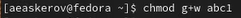{ #fig:15 width=30% }

1.1. Посмотрим используемую в операционной системе файловую систему.

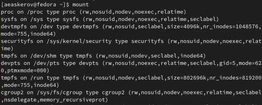{ #fig:16 width=40% }

## Задание 1

1.2. Определим объём свободного пространства на файловой системе с помощью команды df, которая выведет на экран список всех файловых систем в соответствии с именами устройств, с указанием размера и точки монтирования.

{ #fig:17 width=40% }

## Задание 2

2.1. Скопируем файл /usr/include/sys/io.h в домашний каталог и назовём его equipment.

{ #fig:18.png width=40% }

2.2. В домашнем каталоге создадим директорию ~/ski.places.

{ #fig:19 width=30% }

## Задание 2

2.3. Переместим файл equipment в каталог ~/ski.places.

{ #fig:20 width=40% }

2.4. Переименуем файл ~/ski.places/equipment в ~/ski.places/equiplist.

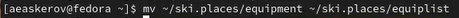{ #fig:21 width=40% }

## Задание 2

2.5. Создадим в домашнем каталоге файл abc1 (уже создан) и скопируем его в каталог ~/ski.places, назовём его equiplist2.

{ #fig:22 width=30% }

2.6. Создадим каталог с именем equipment в каталоге ~/ski.places.

{ #fig:23 width=30% }

## Задание 2

2.7. Переместим файлы ~/ski.places/equiplist и equiplist2 в каталог ~/ski.places/equipment.

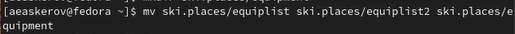{ #fig:24 width=50% }

2.8. Создадим (уже существует) и переместим каталог ~/newdir в каталог ~/ski.places и назовём его plans.

{ #fig:25 width=40% }

## Задание 3

Определим опции команды chmod, необходимые для того, чтобы присвоить перечисленным ниже файлам выделенные права доступа, считая, что в начале таких прав нет.

- 3.1. drwxr--r-- ... australia
- 3.2. drwx--x--x ... play
- 3.3. -r-xr--r-- ... my_os
- 3.4. -rw-rw-r-- ... feathers

{ #fig:26 width=45% }

## Задание 4

4.1. Просмотрим содержимое файла /etc/passwd.

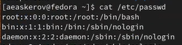{ #fig:27 width=30% }

4.2. Скопируем файл ~/feathers в файл ~/file.old.

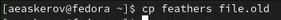{ #fig:28 width=30% }

## Задание 4make

4.3. Переместим файл ~/file.old в каталог ~/play.

{ #fig:29 width=30% }

4.4. Скопируем каталог ~/play в каталог ~/fun.

{ #fig:30 width=30% }

## Задание 4

4.5. Переместим каталог ~/fun в каталог ~/play и назовём его games.

{ #fig:31 width=30% }

4.6. Лишим владельца файла ~/feathers права на чтение.

{ #fig:32 width=30% }

## Задание 4

4.7. Что произойдёт, если мы попытаемся просмотреть файл ~/feathers командой cat? (Будет отказано в доступе)

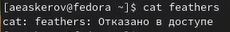{ #fig:33 width=30% }

4.8. Что произойдёт, если мы попытаемся скопировать файл ~/feathers? (Будет отказано в доступе)

{ #fig:34 width=45% }

## Задание 4

4.9. Дадим владельцу файла ~/feathers право на чтение.

{ #fig:35 width=30% }

4.10. Лишим владельца каталога ~/play права на выполнение.

{ #fig:36 width=30% }

## Задание 4

4.11. Перейдём в каталог ~/play. Что произошло? (Произошёл отказ в доступе)

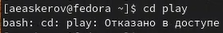{ #fig:37 width=30% }

4.12. Дадим владельцу каталога ~/play право на выполнение.

{ #fig:38 width=30% }

## Задание 5

**Прочитаем man по командам mount, fsck, mkfs, kill и кратко их охарактеризуем.**

Команда mount – позволяет просмотреть используемые в операционной системе файловые системы.

{ #fig:39 width=30% }

Команда fsck – проверка и починка файловой системы Linux.

{ #fig:40 width=30% }

## Задание 5

Команда mksf – построение файловой системы Linux.

{ #fig:41 width=30% }

Команда kill – прекращение процесса.

{ #fig:42 width=30% }

# Вывод
Успешно проведено ознакомление с файловой системой Linux, её структурой, именами и содержанием каталогов. Были приобретены практические навыки по применению команд для работы с файлами и каталогами, по управлению процессами (и работами), по проверке использования диска и обслуживанию файловой системы.
