---
## Front matter
title: "Отчёт по лабораторной работе №5"
subtitle: "Анализ файловой системы Linux. Команды для работы с файлами и каталогами"
author: "Аскеров Александр Эдуардович"

## Generic otions
lang: ru-RU
toc-title: "Содержание"

## Bibliography
bibliography: bib/cite.bib
csl: pandoc/csl/gost-r-7-0-5-2008-numeric.csl

## Pdf output format
toc: true # Table of contents
toc-depth: 2
lof: true # List of figures
lot: false # List of tables
fontsize: 12pt
linestretch: 1.5
papersize: a4
documentclass: scrreprt
## I18n polyglossia
polyglossia-lang:
  name: russian
  options:
	- spelling=modern
	- babelshorthands=true
polyglossia-otherlangs:
  name: english
## I18n babel
babel-lang: russian
babel-otherlangs: english
## Fonts
mainfont: PT Serif
romanfont: PT Serif
sansfont: PT Sans
monofont: PT Mono
mainfontoptions: Ligatures=TeX
romanfontoptions: Ligatures=TeX
sansfontoptions: Ligatures=TeX,Scale=MatchLowercase
monofontoptions: Scale=MatchLowercase,Scale=0.9
## Biblatex
biblatex: true
biblio-style: "gost-numeric"
biblatexoptions:
  - parentracker=true
  - backend=biber
  - hyperref=auto
  - language=auto
  - autolang=other*
  - citestyle=gost-numeric
## Pandoc-crossref LaTeX customization
figureTitle: "Рис."
tableTitle: "Таблица"
listingTitle: "Листинг"
lofTitle: "Список иллюстраций"
lotTitle: "Список таблиц"
lolTitle: "Листинги"
## Misc options
indent: true
header-includes:
  - \usepackage{indentfirst}
  - \usepackage{float} # keep figures where there are in the text
  - \floatplacement{figure}{H} # keep figures where there are in the text
---

# Цель работы

Ознакомиться с файловой системой Linux, её структурой, именами и содержанием каталогов. Приобрести практические навыки по применению команд для работы с файлами и каталогами, по управлению процессами (и работами), по проверке использования диска и обслуживанию файловой системы.

# Теоретическое введение

Команда touch для создания файла.

Команда cat для просмотра содержимого небольшого файла.

Команда less для постраничного просмотра.

Команда head по умолчанию выводит первые 10 строк файла.

Команда tail по умолчанию выводит последние 10 строк файла.

Команда cp для копирования файлов и каталогов.

Команды mv и mvdir предназначены для перемещения и переименования файлов и каталогов.

Права доступа: read, write, execute, -. Тип файла (символ (-) обозначает файл, а символ (d) — каталог); – права для владельца файла (r — разрешено чтение, w — разрешена запись, x — разрешено выполнение, - — право доступа отсутствует); – права для членов группы (r — разрешено чтение, w — разрешена запись, x — разрешено выполнение, - — право доступа отсутствует); – права для всех остальных (r — разрешено чтение, w — разрешена запись, x — разрешено выполнение, - — право доступа отсутствует).

Права доступа к файлу или каталогу можно изменить, воспользовавшись командой chmod. Сделать это может владелец файла (или каталога) или пользователь с правами администратора. Режим (в формате команды) имеет следующие компоненты структуры и способ записи: = установить право; - лишить права; + дать право; r чтение; w запись; x выполнение; u (user) владелец файла; g (group) группа, к которой принадлежит владелец файла; o (others) все остальные. В работе с правами доступа можно использовать их цифровую запись (восьмеричное значение) вместо символьной.

Файловая система в Linux состоит из фалов и каталогов. Каждому физическому носителю соответствует своя файловая система. Существует несколько типов файловых систем. Перечислим наиболее часто встречающиеся типы: – ext2fs (second extended filesystem); – ext2fs (third extended file system); – ext4 (fourth extended file system); – ReiserFS; – xfs; – fat (file allocation table); – ntfs (new technology file system). Для просмотра используемых в операционной системе файловых систем можно воспользоваться командой mount без параметров.

В контексте команды mount устройство — специальный файл устройства, с помощью которого операционная система получает доступ к аппаратному устройству. Файлы устройств обычно располагаются в каталоге /dev, имеют сокращённые имена (например, sdaN, sdbN или hdaN, hdbN, где N — порядковый номер устройства, sd — устройства SCSI, hd — устройства MFM/IDE).

Точка монтирования — каталог (путь к каталогу), к которому присоединяются файлы устройств.

Другой способ определения смонтированных в операционной системе файловых систем — просмотр файла/etc/fstab. Сделать это можно например с помощью команды cat. В таком случае, в каждой строке этого файла будет указано: – имя устройство; – точка монтирования; – тип файловой системы; – опции монтирования; – специальные флаги для утилиты dump; – порядок проверки целостности файловой системы с помощью утилиты fsck.

Для определения объёма свободного пространства на файловой системе можно воспользоваться командой df, которая выведет на экран список всех файловых систем в соответствии с именами устройств, с указанием размера и точки монтирования.

С помощью команды fsck можно проверить (а в ряде случаев восстановить) целостность файловой системы.

# Выполнение лабораторной работы

1. Выполним все примеры, приведённые в первой части описания лабораторной работы.

    1.1. Копирование файла в текущем каталоге. Скопируем файл ~/abc1 в файл april и в файл may.

    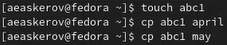{ #fig:1 }

    1.2. Копирование нескольких файлов в каталог. Скопируем файлы april и may в каталог monthly.

    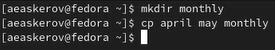{ #fig:2 }

    1.3. Копирование файлов в произвольном каталоге. Скопируем файл monthly/may в файл с именем june.

    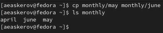{ #fig:3 }

    1.1. Копирование каталогов в текущем каталоге. Скопируем каталог monthly в каталог monthly.00.

    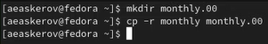{ #fig:4 }

    1.2. Копирование каталогов в произвольном каталоге. Скопируем каталог monthly.00 в каталог /tmp.

    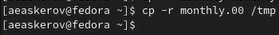{ #fig:5 }

    1.1. Переименование файлов в текущем каталоге. Изменим название файла april на july в домашнем каталоге.

    { #fig:6 }

    1.2. Перемещение файлов в другой каталог. Переместим файл july в каталог monthly.00.

    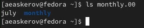{ #fig:7 }

    1.3. Переименование каталогов в текущем каталоге. Переименуем каталог monthly.00 в monthly.01.

    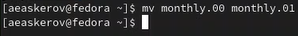{ #fig:8 }

    1.4. Перемещение каталога в другой каталог. Переместим каталог monthly.01в каталог reports.

    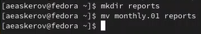{ #fig:9 }

    1.5. Переименование каталога, не являющегося текущим. Переименуем каталог reports/monthly.01 в reports/monthly.

    { #fig:10 }

    1.1. Права доступа.

    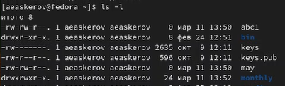{ #fig:11 }

    1.1. Создадим файл ~/may с правом выполнения для владельца.

    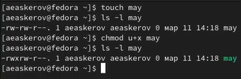{ #fig:12 }

    1.2. Лишим владельца файла ~/may права на выполнение.

    { #fig:13 }

    1.3. Создадим каталог monthly с запретом на чтение для членов группы и всех остальных пользователей.

    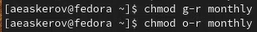{ #fig:14 }

    1.4. Создадим файл ~/abc1 с правом записи для членов группы.

    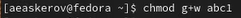{ #fig:15 }

    1.1. Посмотрим используемую в операционной системе файловую систему.

    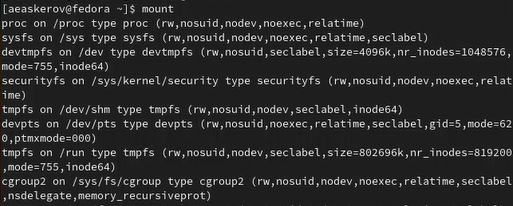{ #fig:16 }

    1.2. Определим объём свободного пространства на файловой системе с помощью команды df, которая выведет на экран список всех файловых систем в соответствии с именами устройств, с указанием размера и точки монтирования.

    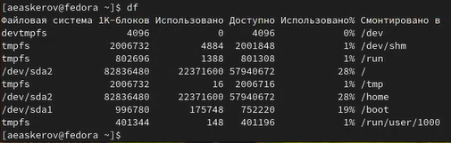{ #fig:17 }

2. Выполним следующие действия, зафиксировав используемые при этом команды и результаты их выполнения.

    2.1. Скопируем файл /usr/include/sys/io.h в домашний каталог и назовём его equipment.

    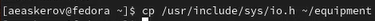{ #fig:18.png }

    2.2. В домашнем каталоге создадим директорию ~/ski.places.

    { #fig:19 }

    2.3. Переместим файл equipment в каталог ~/ski.places.

    { #fig:20 }

    2.4. Переименуем файл ~/ski.places/equipment в ~/ski.places/equiplist.

    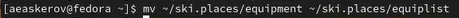{ #fig:21 }

    2.5. Создадим в домашнем каталоге файл abc1 (уже создан) и скопируем его в каталог ~/ski.places, назовём его equiplist2.

    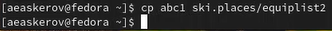{ #fig:22 }

    2.6. Создадим каталог с именем equipment в каталоге ~/ski.places.

    { #fig:23 }

    2.7. Переместим файлы ~/ski.places/equiplist и equiplist2 в каталог ~/ski.places/equipment.

    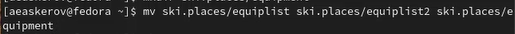{ #fig:24 }

    2.8. Создадим (уже существует) и переместим каталог ~/newdir в каталог ~/ski.places и назовём его plans.

    { #fig:25 }

3. Определим опции команды chmod, необходимые для того, чтобы присвоить перечисленным ниже файлам выделенные права доступа, считая, что в начале таких прав нет.

    3.1. drwxr--r-- ... australia
    3.2. drwx--x--x ... play
    3.3. -r-xr--r-- ... my_os
    3.4. -rw-rw-r-- ... feathers

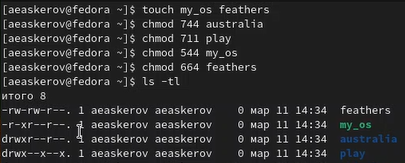{ #fig:26 }

4. Проделаем приведённые ниже упражнения, записывая в отчёт по лабораторной работе используемые при этом команды.

    4.1. Просмотрим содержимое файла /etc/passwd.

    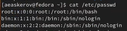{ #fig:27 }

    4.2. Скопируем файл ~/feathers в файл ~/file.old.

    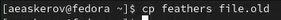{ #fig:28 }

    4.3. Переместим файл ~/file.old в каталог ~/play.

    { #fig:29 }

    4.4. Скопируем каталог ~/play в каталог ~/fun.

    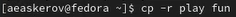{ #fig:30 }

    4.5. Переместим каталог ~/fun в каталог ~/play и назовём его games.

    { #fig:31 }

    4.6. Лишим владельца файла ~/feathers права на чтение.

    { #fig:32 }

    4.7. Что произойдёт, если мы попытаемся просмотреть файл ~/feathers командой cat? (Будет отказано в доступе)

    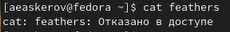{ #fig:33 }

    4.8. Что произойдёт, если мы попытаемся скопировать файл ~/feathers? (Будет отказано в доступе)

    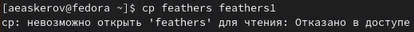{ #fig:34 }

    4.9. Дадим владельцу файла ~/feathers право на чтение.

    { #fig:35 }

    4.10. Лишим владельца каталога ~/play права на выполнение.

    { #fig:36 }

    4.11. Перейдём в каталог ~/play. Что произошло? (Произошёл отказ в доступе)

    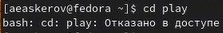{ #fig:37 }

    4.12. Дадим владельцу каталога ~/play право на выполнение.

    { #fig:38 }

5. Прочитаем man по командам mount, fsck, mkfs, kill и кратко их охарактеризуем, приведя примеры.

Команда mount – позволяет просмотреть используемые в операционной системе файловые системы.

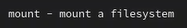{ #fig:39 }

Команда fsck – проверка и починка файловой системы Linux.

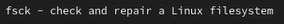{ #fig:40 }

Команда mksf – построение файловой системы Linux.

{ #fig:41 }

Команда kill – прекращение процесса.

{ #fig:42 }

## Контрольные вопросы

1. Дайте характеристику каждой файловой системе, существующей на жёстком диске компьютера, на котором вы выполняли лабораторную работу.

Ext2, Ext3, Ext4 или Extended Filesystem – это стандартная файловая система для Linux. Она была разработана еще для Minix. Она самая стабильная из всех существующих, кодовая база изменяется очень редко и эта файловая система содержит больше всего функций. Версия ext2 была разработана уже именно для Linux и получила много улучшений. В 2001 году вышла ext3, которая добавила ещё больше стабильности благодаря использованию журналирования. В 2006 была выпущена версия ext4, которая используется во всех дистрибутивах Linux до сегодняшнего дня. В неё было внесено много улучшений, в том числе увеличен максимальный размер раздела до одного экзабайта.

JFS или Journaled File System была разработана в IBM для AIX UNIX и использовалась в качестве альтернативы для файловых систем ext. Сейчас она используется там, где необходима высокая стабильность и минимальное потребление ресурсов. При разработке файловой системы ставилась цель создать максимально эффективную файловую систему для многопроцессорных компьютеров. Также как и ext, это журналируемая файловая система, но в журнале хранятся только метаданные, что может привести к использованию старых версий файлов после сбоев.

ReiserFS - была разработана намного позже, в качестве альтернативы ext3 с улучшенной производительностью и расширенными возможностями. Она была разработана под руководством Ганса Райзера и поддерживает только Linux. Из особенностей можно отметить динамический размер блока, что позволяет упаковывать несколько небольших файлов в один блок, что предотвращает фрагментацию и улучшает работу с небольшими файлами. Ещё одно преимущество – в возможности изменять размеры разделов на лету. Но минус в некоторой нестабильности и риске потери данных при отключении энергии. Раньше ReiserFS применялась по умолчанию в SUSE Linux, но сейчас разработчики перешли на Btrfs.

XFS – это высокопроизводительная файловая система, разработанная в Silicon Graphics для собственной операционной системы еще в 2001 году. Она изначально была рассчитана на файлы большого размера, и поддерживала диски до 2 Терабайт. Из преимуществ файловой системы можно отметить высокую скорость работы с большими файлами, отложенное выделение места, увеличение разделов на лету и незначительный размер служебной информации.

XFS – журналируемая файловая система, однако в отличие от ext, в журнал записываются только изменения метаданных. Она используется по умолчанию в дистрибутивах на основе Red Hat. Из недостатков – невозможность уменьшения размера, сложность восстановления данных и риск потери файлов при записи, если будет неожиданное отключение питания, поскольку большинство данных находятся в памяти.

Btrfs или B-Tree File System – это совершенно новая файловая система, сосредоточенная на отказоустойчивости, лёгкости администрирования и восстановлении данных. Файловая система объединяет в себе очень много новых интересных возможностей, таких как размещение на нескольких разделах, поддержка подтомов, изменение размера не лету, создание мгновенных снимков, а также высокая производительность. Но многие пользователи считают файловую систему Btrfs нестабильной. Тем не менее, она уже используется как файловая система по умолчанию в OpenSUSE и SUSE Linux.

2. Приведите общую структуру файловой системы и дайте характеристику каждой директории первого уровня этой структуры.

/ — root каталог. Содержит в себе всю иерархию системы;

/bin — здесь находятся двоичные исполняемые файлы. Основные общие команды, хранящиеся отдельно от других программ в системе (прим.: pwd, ls, cat, ps);

/boot — тут расположены файлы, используемые для загрузки системы (образ initrd, ядро vmlinuz);

/dev — в данной директории располагаются файлы устройств (драйверов). С помощью этих файлов можно взаимодействовать с устройствами. К примеру, если это жесткий диск, можно подключить его к файловой системе. В файл принтера же можно написать напрямую и отправить задание на печать;

/etc — в этой директории находятся файлы конфигураций программ. Эти файлы позволяют настраивать системы, сервисы, скрипты системных демонов;

/home — каталог, аналогичный каталогу Users в Windows. Содержит домашние каталоги учетных записей пользователей (кроме root). При создании нового пользователя здесь создается одноименный каталог с аналогичным именем и хранит личные файлы этого пользователя;

/lib — содержит системные библиотеки, с которыми работают программы и модули ядра;

/lost+found — содержит файлы, восстановленные после сбоя работы системы. Система проведет проверку после сбоя и найденные файлы можно будет посмотреть в данном каталоге;

/media — точка монтирования внешних носителей. Например, когда вы вставляете диск в дисковод, он будет автоматически смонтирован в директорию /media/cdrom;

/mnt — точка временного монтирования. Файловые системы подключаемых устройств обычно монтируются в этот каталог для временного использования;

/opt — тут расположены дополнительные (необязательные) приложения. Такие программы обычно не подчиняются принятой иерархии и хранят свои файлы в одном подкаталоге (бинарные, библиотеки, конфигурации);

/proc — содержит файлы, хранящие информацию о запущенных процессах и о состоянии ядра ОС;

/root — директория, которая содержит файлы и личные настройки суперпользователя;

/run — содержит файлы состояния приложений. Например, PID-файлы или UNIX-сокеты;

/sbin — аналогично /bin содержит бинарные файлы. Утилиты нужны для настройки и администрирования системы суперпользователем;

/srv — содержит файлы сервисов, предоставляемых сервером (прим. FTP или Apache HTTP);

/sys — содержит данные непосредственно о системе. Тут можно узнать информацию о ядре, драйверах и устройствах;

/tmp — содержит временные файлы. Данные файлы доступны всем пользователям на чтение и запись. Стоит отметить, что данный каталог очищается при перезагрузке;

/usr — содержит пользовательские приложения и утилиты второго уровня, используемые пользователями, а не системой. Содержимое доступно только для чтения (кроме root). Каталог имеет вторичную иерархию и похож на корневой;

/var — содержит переменные файлы. Имеет подкаталоги, отвечающие за отдельные переменные. Например, логи будут храниться в /var/log, кэш в /var/cache, очереди заданий в /var/spool/ и так далее.

3. Какая операция должна быть выполнена, чтобы содержимое некоторой файловой системы было доступно операционной системе?

Монтирование тома.

4. Назовите основные причины нарушения целостности файловой системы. Как устранить повреждения файловой системы?

Отсутствие синхронизации между образом файловой системы в памяти и её данными на диске в случае аварийного останова может привести к появлению следующих ошибок:

- Один блок адресуется несколькими mode (принадлежит нескольким файлам).
- Блок помечен как свободный, но в то же время занят (на него ссылается inode).
- Блок помечен как занятый, но в то же время свободен (ни один inode на него не ссылается).
- Неправильное число ссылок в inode (недостаток или избыток ссылающихся записей в каталогах).
- Несовпадение между размером файла и суммарным размером адресуемых inode блоков.
- Недопустимые адресуемые блоки (например, расположенные за пределами файловой системы).
- "Потерянные" файлы (правильные inode, на которые не ссылаются записи каталогов).
- Недопустимые или неразмещенные номера inode в записях каталогов.

5. Как создаётся файловая система?

mkfs - позволяет создать файловую систему Linux.

6. Дайте характеристику командам для просмотра текстовых файлов.

Cat - выводит содержимое файла на стандартное устройство вывода

7. Приведите основные возможности команды cp в Linux.

Cp – копирует или перемещает директорию, файлы.

8. Приведите основные возможности команды mv в Linux.

Mv - переименовать или переместить файл или директорию

9. Что такое права доступа? Как они могут быть изменены?

Права доступа к файлу или каталогу можно изменить, воспользовавшись командой chmod. Сделать это может владелец файла (или каталога) или пользователь с правами администратора.

# Выводы
Успешно проведено ознакомление с файловой системой Linux, её структурой, именами и содержанием каталогов. Были приобретены практические навыки по применению команд для работы с файлами и каталогами, по управлению процессами (и работами), по проверке использования диска и обслуживанию файловой системы.
