---
## Front matter
lang: ru-RU
title: Презентация №7
subtitle: Командная оболочка Midnight Commander
author:
  - Аскеров А.Э.
institute:
  - Российский университет дружбы народов, Москва, Россия
date: 25 марта 2023

## i18n babel
babel-lang: russian
babel-otherlangs: english

## Formatting pdf
toc: false
toc-title: Содержание
slide_level: 2
aspectratio: 169
section-titles: true
theme: metropolis
header-includes:
 - \metroset{progressbar=frametitle,sectionpage=progressbar,numbering=fraction}
 - '\makeatletter'
 - '\beamer@ignorenonframefalse'
 - '\makeatother'
---

# Вступление

## Цель работы

Освоить основные возможности командной оболочки Midnight Commander. Приобрести навыки практической работы по просмотру каталогов и файлов; манипуляциями с ними.

## Задание

Задание по mc

1. Изучите информацию о mc, вызвав в командной строке man mc.

2. Запустите из командной строки mc, изучите его структуру и меню.

3. Выполните несколько операций в mc, используя управляющие клавиши (операции с панелями; выделение/отмена выделения файлов, копирование/перемещение файлов, получение информации о размере и правах доступа на файлы и/или каталоги и т.п.)

4. Выполните основные команды меню левой (или правой) панели. Оцените степень подробности вывода информации о файлах.

## Задание

5. Используя возможности подменю Файл, выполните:

- просмотр содержимого текстового файла;

- редактирование содержимого текстового файла (без сохранения результатов редактирования);

- создание каталога;

- копирование файлов в созданный каталог.

## Задание

6. С помощью соответствующих средств подменю Команда осуществите:

- поиск в файловой системе файла с заданными условиями (например, файла с расширением .c или .cpp, содержащего строку main);

- выбор и повторение одной из предыдущих команд;

- переход в домашний каталог;

- анализ файла меню и файла расширений.

7. Вызовите подменю Настройки. Освойте операции, определяющие структуру экрана mc (Full screen, Double Width, Show Hidden Files и т.д).

## Задание

Задание по встроенному редактору mc

1. Создайте текстовый файл text.txt.

2. Откройте этот файл с помощью встроенного в mc редактора.

3. Вставьте в открытый файл небольшой фрагмент текста, скопированный из любого другого файла или Интернета.

## Задание

4. Проделайте с текстом следующие манипуляции, используя горячие клавиши:

    4.1. Удалите строку текста.

    4.2. Выделите фрагмент текста и скопируйте его на новую строку.

    4.3. Выделите фрагмент текста и перенесите его на новую строку.

    4.4. Сохраните файл.

    4.5. Отмените последнее действие.

    4.6. Перейдите в конец файла (нажав комбинацию клавиш) и напишите некоторый 
    текст.

    4.7. Перейдите в начало файла (нажав комбинацию клавиш) и напишите некоторый текст.

    4.8. Сохраните и закройте файл.

## Задание

5. Откройте файл с исходным текстом на некотором языке программирования (например C или Java)

6. Используя меню редактора, включите подсветку синтаксиса, если она не включена, или выключите, если она включена.

# Теоретическое введение

Командная оболочка — интерфейс взаимодействия пользователя с операционной системой и программным обеспечением посредством команд.

Midnight Commander — псевдографическая командная оболочка для UNIX систем. Для запуска необходимо написать mc в командной строке и нажать Enter.

Встроенный в mc редактор вызывается с помощью функциональной клавиши F4. В нём удобно использовать различные комбинации клавиш при редактировании содержимого (как правило текстового) файла.

# Выполнение лабораторной работы

# Задание по mc

## Задание 1

1. Изучим информацию о mc, вызвав в командной строке man mc.

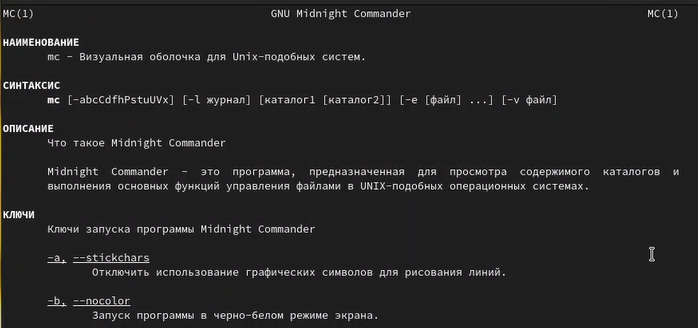{ width=50% }

## Задание 2

2. Запустим из командной строки mc, изучим его структуру и меню.

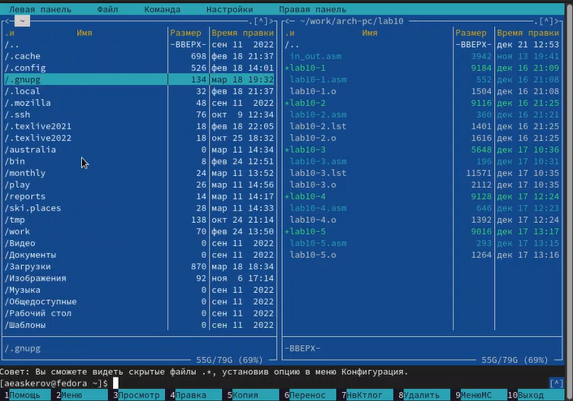{ width=50% }

## Задание 3

3. Выполним несколько операций в mc, используя управляющие клавиши. Например, выделение файлов производится с помощью кнопки Shift и кнопок стрелок либо нажимая на файлы правой кнопкой мыши.

Копирование файлов производится с помощью клавиши F5.

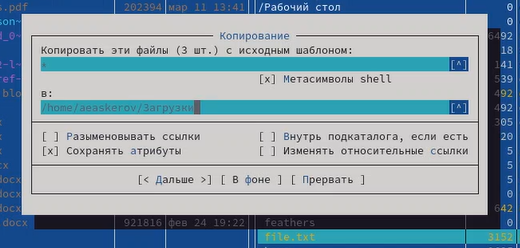{ width=30% }

Перемещение производится с помощью клавиши F6.

## Задание 3

Получение различной информации о файле, такой как, например, размер, права доступа, производится с помощью нажатия на интересуемый файл и затем нажатия кнопки Информация в разделе Левая/Правая панель.

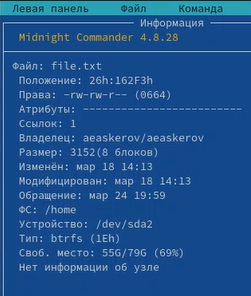{ width=30% }

## Задание 4

4. Выполним основные команды меню левой (или правой) панели. Посмотрим список файлов выбранного каталога, быстрый просмотр содержимого выбранного файла, дерево каталогов, подробную информацию о файле, включим опции Порядок сортировки и Фильтр.

## Задание 5

5. Используя возможности подменю “Файл”, выполним:

- просмотр содержимого текстового файла;

{ width=25% }

## Задание 5

- редактирование содержимого текстового файла (без сохранения результатов редактирования);

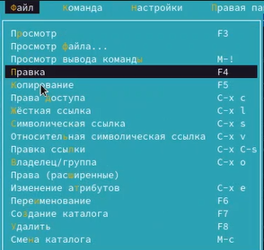{ width=30% }

## Задание 5

- создание каталога;

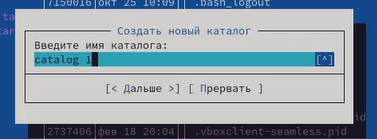{ width=30% }

- копирование файлов в созданный каталог.

{ width=30% }

## Задание 6

6. С помощью соответствующих средств подменю “Команда” осуществим:

- поиск в файловой системе файла с заданными условиями (например, файла с расширением .c или .cpp, содержащего строку main);

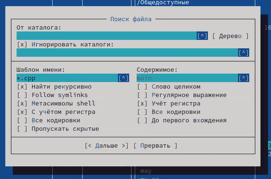{ width=40% }

## Задание 6

- выбор и повторение одной из предыдущих команд;

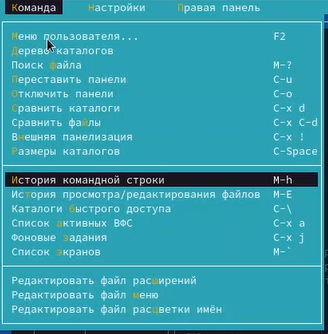{ width=30% }

## Задание 6

- переход в домашний каталог;

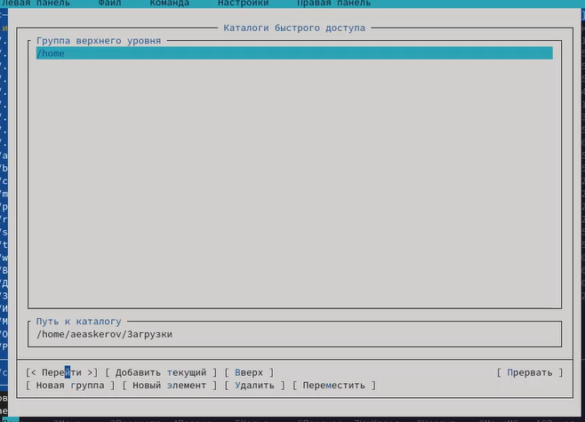{ width=60% }

## Задание 6

- анализ файла меню и файла расширений.

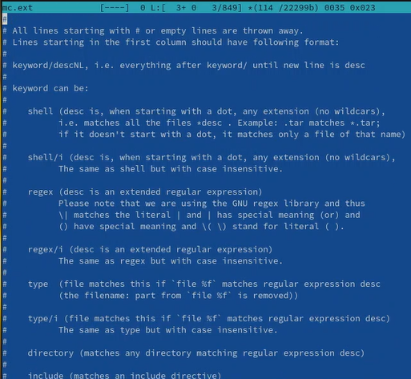{ width=30% }

## Задание 6

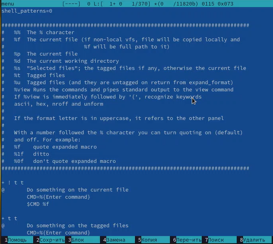{ width=30% }

## Задание 7

7. Вызовем подменю “Настройки”. Освоим операции, определяющие структуру экрана mc (Full screen, Double Width, Show Hidden Files и т.д.).

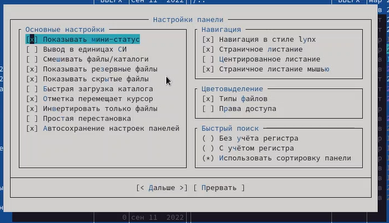{ width=30% }

# Задание по встроенному редактору mc

## Задания 1-3

1. Создадим текстовый файл text.txt, используя команду touch.

2. Откроем этот файл с помощью встроенного в mc редактора командой mc.

3. Вставим в открытый файл небольшой фрагмент текста, скопированный из любого другого файла или Интернета с помощью Shift + Ins.

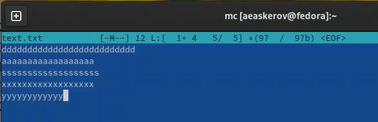{ width=30% }

## Задание 4

4. Проделаем с текстом манипуляции, используя горячие клавиши.
    
    Удаление происходит с помощью комбинации клавиш Ctrl + y.

    Для копирования нажимаем F5.

    Перенос происходит с помощью клавиши F6. Нужно выделить текст, нажать F6, выбрать курсором место для переноса текста и снова нажать F6.

    Для сохранения файла нужно нажать F2.

    Для отмены последнего действия используется комбинация клавиш Ctrl + u.
    
    Переход в конец файла осуществляется с помощью комбинации клавиш Ctrl + End.
    
    Переход в конец файла осуществляется с помощью комбинации клавиш Ctrl + Home.
    
    Сохраним и закроем файл. Для этого нажмём F2 (Сохранить) и F10 (Выйти).

## Задание 5

5. Откроем файл с исходным текстом на некотором языке программирования (например, C или Java).

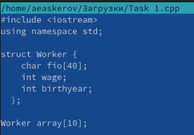{ width=30% }

## Задание 6

6. Используя меню редактора, включим\\выключим подсветку синтаксиса.

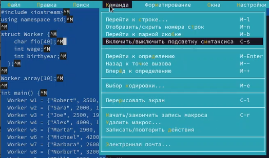{ width=30% }

# Заключение

Освоены основные возможности командной оболочки Midnight Commander. Приобретены навыки практической работы по просмотру каталогов и файлов; манипуляциями с ними.
