---
## Front matter
title: "Отчёт по лабораторной работе №7"
subtitle: "Командная оболочка Midnight Commander"
author: "Аскеров Александр Эдуардович"

## Generic otions
lang: ru-RU
toc-title: "Содержание"

## Bibliography
bibliography: bib/cite.bib
csl: pandoc/csl/gost-r-7-0-5-2008-numeric.csl

## Pdf output format
toc: true # Table of contents
toc-depth: 2
lof: true # List of figures
lot: false # List of tables
fontsize: 12pt
linestretch: 1.5
papersize: a4
documentclass: scrreprt
## I18n polyglossia
polyglossia-lang:
  name: russian
  options:
	- spelling=modern
	- babelshorthands=true
polyglossia-otherlangs:
  name: english
## I18n babel
babel-lang: russian
babel-otherlangs: english
## Fonts
mainfont: PT Serif
romanfont: PT Serif
sansfont: PT Sans
monofont: PT Mono
mainfontoptions: Ligatures=TeX
romanfontoptions: Ligatures=TeX
sansfontoptions: Ligatures=TeX,Scale=MatchLowercase
monofontoptions: Scale=MatchLowercase,Scale=0.9
## Biblatex
biblatex: true
biblio-style: "gost-numeric"
biblatexoptions:
  - parentracker=true
  - backend=biber
  - hyperref=auto
  - language=auto
  - autolang=other*
  - citestyle=gost-numeric
## Pandoc-crossref LaTeX customization
figureTitle: "Рис."
tableTitle: "Таблица"
listingTitle: "Листинг"
lofTitle: "Список иллюстраций"
lotTitle: "Список таблиц"
lolTitle: "Листинги"
## Misc options
indent: true
header-includes:
  - \usepackage{indentfirst}
  - \usepackage{float} # keep figures where there are in the text
  - \floatplacement{figure}{H} # keep figures where there are in the text
---

# Цель работы

Освоить основные возможности командной оболочки Midnight Commander. Приобрести навыки практической работы по просмотру каталогов и файлов; манипуляциями с ними.

# Задание

Задание по mc

1. Изучите информацию о mc, вызвав в командной строке man mc.

2. Запустите из командной строки mc, изучите его структуру и меню.

3. Выполните несколько операций в mc, используя управляющие клавиши (операции с панелями; выделение/отмена выделения файлов, копирование/перемещение файлов, получение информации о размере и правах доступа на файлы и/или каталоги и т.п.)

4. Выполните основные команды меню левой (или правой) панели. Оцените степень подробности вывода информации о файлах.

5. Используя возможности подменю Файл, выполните:

- просмотр содержимого текстового файла;

- редактирование содержимого текстового файла (без сохранения результатов редактирования);

- создание каталога;

- копирование файлов в созданный каталог.

6. С помощью соответствующих средств подменю Команда осуществите:

- поиск в файловой системе файла с заданными условиями (например, файла с расширением .c или .cpp, содержащего строку main);

- выбор и повторение одной из предыдущих команд;

- переход в домашний каталог;

- анализ файла меню и файла расширений.

7. Вызовите подменю Настройки. Освойте операции, определяющие структуру экрана mc (Full screen, Double Width, Show Hidden Files и т.д).

Задание по встроенному редактору mc

1. Создайте текстовый файл text.txt.

2. Откройте этот файл с помощью встроенного в mc редактора.

3. Вставьте в открытый файл небольшой фрагмент текста, скопированный из любого другого файла или Интернета.

4. Проделайте с текстом следующие манипуляции, используя горячие клавиши:

    4.1. Удалите строку текста.

    4.2. Выделите фрагмент текста и скопируйте его на новую строку.

    4.3. Выделите фрагмент текста и перенесите его на новую строку.

    4.4. Сохраните файл.

    4.5. Отмените последнее действие.

    4.6. Перейдите в конец файла (нажав комбинацию клавиш) и напишите некоторый 
    текст.

    4.7. Перейдите в начало файла (нажав комбинацию клавиш) и напишите некоторый текст.

    4.8. Сохраните и закройте файл.

5. Откройте файл с исходным текстом на некотором языке программирования (например C или Java)

6. Используя меню редактора, включите подсветку синтаксиса, если она не включена, или выключите, если она включена.

# Теоретическое введение

Командная оболочка — интерфейс взаимодействия пользователя с операционной системой и программным обеспечением посредством команд.

Midnight Commander — псевдографическая командная оболочка для UNIX систем. Для запуска необходимо написать mc в командной строке и нажать Enter.

Встроенный в mc редактор вызывается с помощью функциональной клавиши F4. В нём удобно использовать различные комбинации клавиш при редактировании содержимого (как правило текстового) файла.

# Выполнение лабораторной работы

Задание по mc

1. Изучим информацию о mc, вызвав в командной строке man mc.

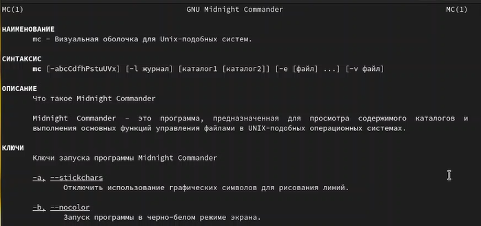{ #fig:1 }

2. Запустим из командной строки mc, изучим его структуру и меню.

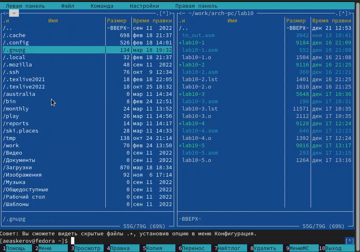{ #fig:2 }

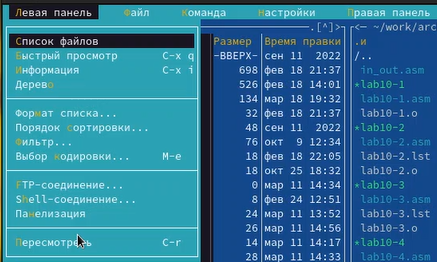{ #fig:3 }

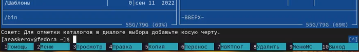{ #fig:4 }

3. Выполним несколько операций в mc, используя управляющие клавиши (операции с панелями; выделение/отмена выделения файлов, копирование/перемещение файлов, получение информации о размере и правах доступа на файлы и/или каталоги и т.п.).

Посмотрим операции с панелями.

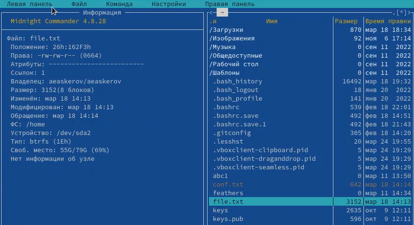{ #fig:5 }

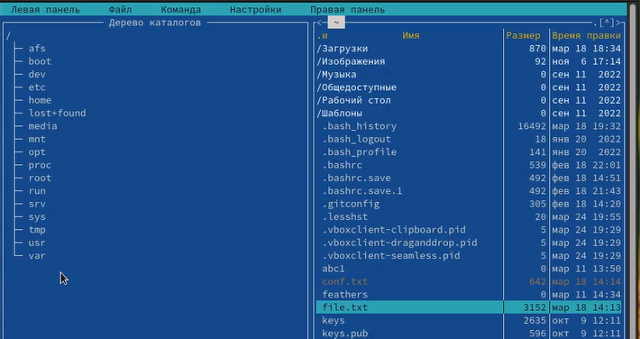{ #fig:6 }

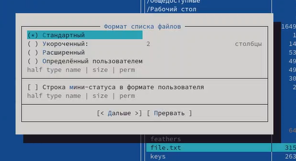{ #fig:7 }

Выделение файлов производится с помощью кнопки Shift и кнопок стрелок либо нажимая на файлы правой кнопкой мыши.

Копирование файлов производится с помощью клавиши F5.

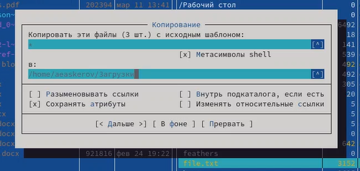{ #fig:8 }

Перемещение производится с помощью клавиши F6.

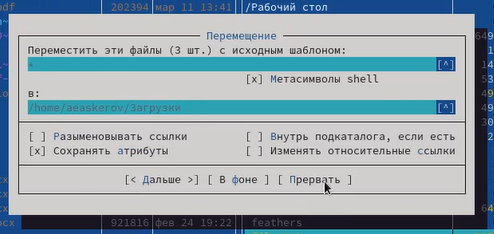{ #fig:9 }

Получение различной информации о файле, такой как, например, размер, права доступа, производится с помощью нажатия на интересуемый файл и затем нажатия кнопки Информация в разделе Левая/Правая панель.

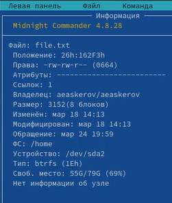{ #fig:10 }

4. Выполним основные команды меню левой (или правой) панели. Оценим степень подробности вывода информации о файлах.

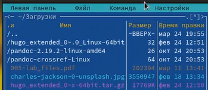{ #fig:11 }

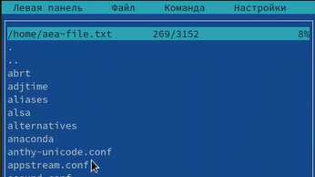{ #fig:12 }

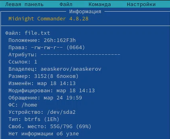{ #fig:13 }

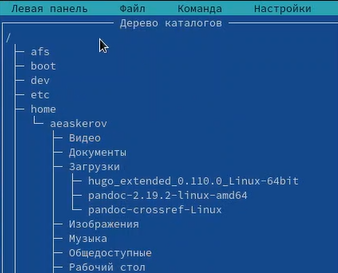{ #fig:14 }

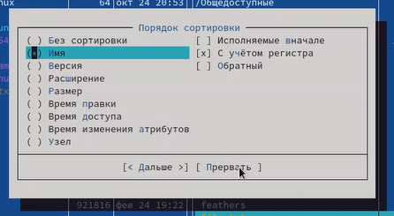{ #fig:15 }

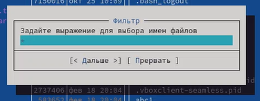{ #fig:16 }

5. Используя возможности подменю “Файл”, выполним:

- просмотр содержимого текстового файла;

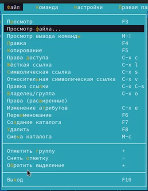{ #fig:17 }

- редактирование содержимого текстового файла (без сохранения результатов редактирования);

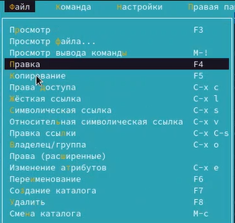{ #fig:18 }

- создание каталога;

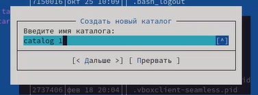{ #fig:19 }

- копирование файлов в созданный каталог.

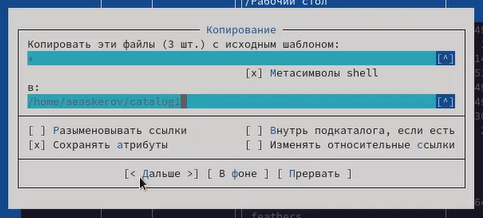{ #fig:20 }

6. С помощью соответствующих средств подменю “Команда” осуществим:

- поиск в файловой системе файла с заданными условиями (например, файла с расширением .c или .cpp, содержащего строку main);

{ #fig:21 }

- выбор и повторение одной из предыдущих команд;

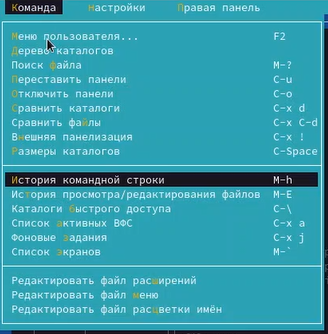{ #fig:22 }

- переход в домашний каталог;

{ #fig:23 }

- анализ файла меню и файла расширений.

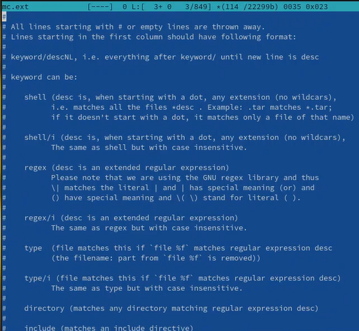{ #fig:24 }

{ #fig:25 }

7. Вызовем подменю “Настройки”. Освоим операции, определяющие структуру экрана mc (Full screen, Double Width, Show Hidden Files и т.д.).

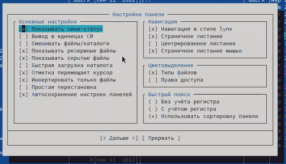{ #fig:26 }

Задание по встроенному редактору mc

1. Создадим текстовый файл text.txt.

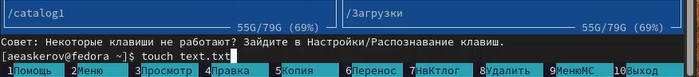{ #fig:27 }

2. Откроем этот файл с помощью встроенного в mc редактора.

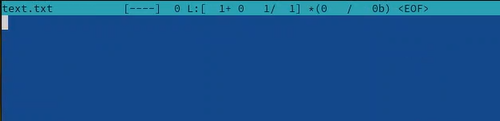{ #fig:28 }

3. Вставим в открытый файл небольшой фрагмент текста, скопированный из любого другого файла или Интернета.

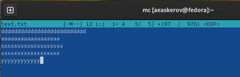{ #fig:29 }

4. Проделайте с текстом следующие манипуляции, используя горячие клавиши:

    4.1. Удалим строку текста.

    Удаление происходит с помощью комбинации клавиш Ctrl + y.

    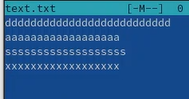{ #fig:30 }

    4.2. Выделим фрагмент текста и скопируем его на новую строку.

    Для копирования нажимаем F5.

    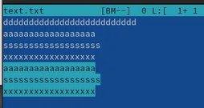{ #fig:31 }

    4.3. Выделим фрагмент текста и перенесём его на новую строку.

    Перенос происходит с помощью клавиши F6. Нужно выделить текст, нажать F6, выбрать курсором место для переноса текста и снова нажать F6.

    4.4. Сохраним файл.

    Для сохранения файла нужно нажать F2.

    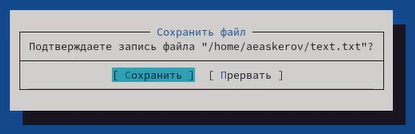{ #fig:32 }

    4.5. Отменим последнее действие.

    Для отмены последнего действия используется комбинация клавиш Ctrl + u.

    4.6. Перейдём в конец файла (нажав комбинацию клавиш) и напишем некоторый текст.

    Переход в конец файла осуществляется с помощью комбинации клавиш Ctrl + End.

    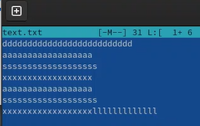{ #fig:33 }

    4.7. Перейдём в начало файла (нажав комбинацию клавиш) и напишем некоторый текст.

    Переход в конец файла осуществляется с помощью комбинации клавиш Ctrl + Home.

    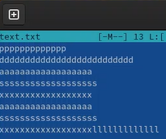{ #fig:34 }

    4.8. Сохраним и закроем файл.

    Для этого нажмём F2 (Сохранить) и F10 (Выйти).

5. Откроем файл с исходным текстом на некотором языке программирования (например, C или Java).

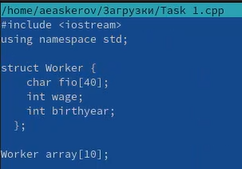{ #fig:35 }

6. Используя меню редактора, включим подсветку синтаксиса, если она не включена, или выключим, если она включена.

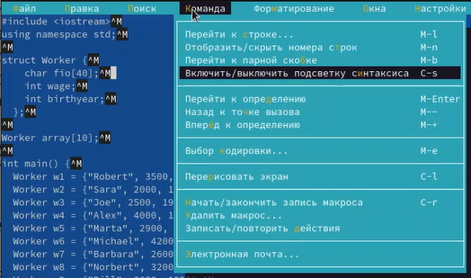{ #fig:36 }

# Контрольные вопросы

1. Какие режимы работы есть в mc. Охарактеризуйте их.

Панели могут дополнительно быть переведены в один из двух режимов: «Информация» или «Дерево». В режиме «Информация» на панель выводятся сведения о файле и текущей файловой системе, расположенных на активной панели. В режиме «Дерево» на одной из панелей выводится структура дерева каталогов. 

2. Какие операции с файлами можно выполнить как с помощью команд shell, так и с помощью меню (комбинаций клавиш) mc? Приведите несколько примеров.

- копирование «F5» («cp имя_файла имя_каталога (в который копируем)») 
- перемещение/переименование «F6» («mv имя_файла имя_каталога (в который перемещаем)») 
- создание каталога «F7» («mkdir имя_каталога»)
- удаление «F8» («rm имя_файла»)
- изменение прав доступа «ctrl+x» («chmod u+x имя_файла»)
 
3. Опишите структуру меню левой (или правой) панели mc, дайте характеристику командам.

Перейти в строку меню панелей mc можно с помощью функциональной клавиши «F9». В строке меню имеются пять меню: «Леваяпанель», «Файл», «Команда», «Настройки» и «Праваяпанель».

Под пункт меню «Быстрый просмотр» позволяет выполнить быстрый просмотр содержимого панели.

Подпункт меню «Информация» позволяет посмотреть информацию о файле или каталоге. В меню каждой (левой или правой) панели можно выбрать «Формат списка»:

- стандартный: выводит список файлов и каталогов с указанием размера и времени правки;
- ускоренный: позволяет задать число столбцов, на которые разбивается панель при выводе списка имён файлов или каталогов без дополнительной информации;
- расширенный: помимо названия файла или каталога выводит сведения о правах доступа, владельце, группе, размере, времени правки;
- определённый пользователем: позволяет вывести те сведения о файле или каталоге, которые задаст сам пользователь.

Подпункт меню «Порядок сортировки» позволяет задать критерии сортировки при выводе списка файлов и каталогов: без сортировки, по имени, расширенный, время правки, время доступа, время изменения атрибута, размер, узел. 

4. Опишите структуру меню Файл mc, дайте характеристику командам.

Команды меню «Файл»:
 
- Просмотр(«F3»): позволяет посмотреть содержимое текущего (или выделенного) файла без возможности редактирования.
- Просмотр вывода команды («М»+«!»): функция запроса команды с параметрами (аргумент к текущему выбранному файлу).
- Правка(«F4»): открывает текущий (или выделенный) файл для его редактирования.
- Копирование(«F5»): осуществляет копирование одного или нескольких файлов или каталогов в указанное пользователем во всплывающем окне место.
- Права доступа («Ctrl-x»«c»): позволяет указать (изменить) права доступа к одному или нескольким файлам или каталогам.
- Жёсткая ссылка («Ctrl-x»«l»): позволяет создать жёсткую ссылку к текущему(или выделенному) файлу.
- Символическая ссылка («Ctrl-x»«s»): позволяет создать символическую ссылку к текущему (или выделенному) файлу.
- Владелец/группа («Ctrl-x»«o»): позволяет задать (изменить) владельца и имя группы для одного или нескольких файлов или каталогов.
- Права(расширенные): позволяет изменить права доступа и владения для одного или нескольких файлов или каталогов.
- Переименование («F6»): позволяет переименовать (или переместить) один или несколько файлов или каталогов.
- Создание каталога («F7»): позволяет создать каталог.
- Удалить («F8»): позволяет удалить один или несколько файлов или каталогов.
- Выход («F10»): завершает работу mc.
 
5. Опишите структуру меню Команда mc, дайте характеристику командам.

Меню Команда

В меню Команда содержатся более общие команды для работы с mc.

Команды меню Команда:

- Дерево каталогов: отображает структуру каталогов системы.
- Поиск файла: выполняет поиск файлов по заданным параметрам.
- Переставить панели: меняет местами левую и правую панели.
- Сравнить каталоги («Ctrl-x»«d»): сравнивает содержимое двух каталогов.
- Размеры каталогов: отображает размер и время изменения каталога (по умолчанию в mc размер каталога корректно не отображается).
- История командной строки: выводит на экран список ранее выполненных в оболочке команд.
- Каталоги быстрого доступа(Ctrl-»): при вызове выполняется быстрая смена текущего каталога на один из заданного списка.
- Восстановление файлов: позволяет восстановить файлы на файловых системах ext2 и ext3.
- Редактировать файл расширений: позволяет задать с
- Редактировать файл меню: позволяет отредактировать контекстное меню пользователя, вызываемое по клавише «F2».
- Редактировать файл расцветки имён: позволяет подобрать оптимальную для пользователя расцветку имён файлов в зависимости от их типа. 

6. Опишите структура меню Настройки mc, дайте характеристику командам.

Меню Настройки содержит ряд дополнительных опций по внешнему виду и функциональности mc.

Меню Настройки содержит:

- Конфигурация: позволяет скорректировать настройки работы с панелями.
- Внешний вид и Настройки панелей: определяет элементы (строка меню, командная строка, подсказки и прочее), отображаемые при вызове mc, а также геометрию расположения панелей и цветовыделение.
- Биты символов: задаёт формат обработки информации локальным терминалом.
- Подтверждение: позволяет установить или убрать вывод окна с запросом подтверждения действий при операциях удаления и перезаписи файлов, а также при выходе из программы.
- Распознание клавиш: диалоговое окно используется для тестирования функциональных клавиш, клавиш управления курсором и прочее.
- Виртуальные ФС: настройки виртуальной файловой системы: тайм-аут, пароль и прочее.
 
7. Назовите и дайте характеристику встроенным командам mc.

Функциональные клавиши mc:

- F1: вызов контекстно-зависимой подсказки
- F2: вызов пользовательского меню с возможностью создания и/или дополнения дополнительных функций
- F3: просмотр содержимого файла, на который указывает подсветка в активной панели (без возможности редактирования)
- F4: вызов встроенного в mc редактора для изменения содержания файла, на который указывает подсветка в активной панели
- F5: копирование одного или нескольких файлов, отмеченных впервой (активной) панели, в каталог, отображаемый на второй панели
- F6: перенос одного или нескольких файлов, отмеченных в первой (активной) панели, в каталог, отображаемый на второй панели
- F7: создание подкаталога в каталоге, отображаемом в активной панели
- F8: удаление одного или нескольких файлов (каталогов), отмеченных в первой (активной) панели файлов
- F9: вызов меню mc
- F10: выход из mc 

8. Назовите и дайте характеристику командам встроенного редактора mc.

Встроенный в mc редактор вызывается с помощью функциональной клавиши «F4». В нём удобно использовать различные комбинации клавиш при редактировании содержимого (как правило текстового) файла. Клавиши для редактирования файла:

- «Ctrl-y»: удалить строку
- «Ctrl-u»: отмена последней операции
- «ins»: вставка/замена
- «F7»: поиск (можно использовать регулярные выражения)
- «Стрелка вверх-F7»: повтор последней операции поиска
- «F4»: замена
- «F3»: первое нажатие: начало выделения, второе: окончание выделения
- «F5»: копировать выделенный фрагмент
- «F6»: переместить выделенный фрагмент
- «F8»: удалить выделенный фрагмент
- «F2»: записать изменения в файл
- «F10»: выйти из редактор 

9. Дайте характеристику средствам mc, которые позволяют создавать меню, определяемые пользователем.

Для редактирования меню пользователя, которое вызывается клавишей «F2», необходимо перейти в пункт «Редактировать файл меню» «Команда» и изменить настройки файла.
 
10. Дайте характеристику средствам mc, которые позволяют выполнять действия, определяемые пользователем, над текущим файлом.

Часть команд «Меню пользователя», а также меню «Файл» позволяют выполнять действия, определяемые пользователем, над текущим файлом. Например, копирование каталога или файла, переименование, перемещение, архивирование.

# Выводы

Освоены основные возможности командной оболочки Midnight Commander. Приобретены навыки практической работы по просмотру каталогов и файлов; манипуляциями с ними.

