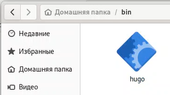
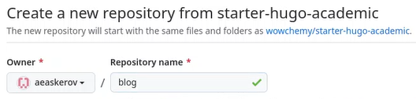
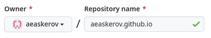
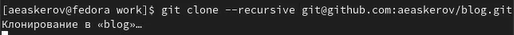
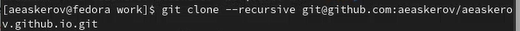
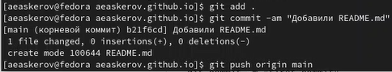
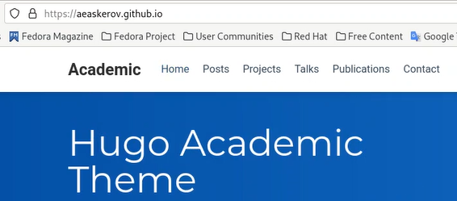

---
## Front matter
lang: ru-RU
title: Индивидуальный проект
subtitle: Этап 1
author:
  - Аскеров А.Э.
institute:
  - Российский университет дружбы народов, Москва, Россия
date: 24 февраля 2023

## i18n babel
babel-lang: russian
babel-otherlangs: english

## Formatting pdf
toc: false
toc-title: Содержание
slide_level: 2
aspectratio: 169
section-titles: true
theme: metropolis
header-includes:
 - \metroset{progressbar=frametitle,sectionpage=progressbar,numbering=fraction}
 - '\makeatletter'
 - '\beamer@ignorenonframefalse'
 - '\makeatother'
---

# Вступление

## Цель работы

Размещение на Github pages заготовки для персонального сайта

## Задание

* Установить необходимое программное обеспечение
* Скачать шаблон темы сайта
* Разместить его на хостинге git
* Установить параметр для URLs сайта
* Разместить заготовку сайта на Github pages

# Выполнение этапа 1

## Установка hugo

Мы начинаем работу со скачивания hugo

{ width=40% }

## Создание репозитория blog

Для нашего проекта необходимо создать репозиторий. Назовём его blog. В нём будет храниться материал нашего сайта

{ width=40% }

## Создание репозитория сайта

Также требуется создать ещё один репозиторий, где будут файлы, на основе которых работает сайт

{ width=40% }

## Синхронизация

После создания репозиториев нужно клонировать их и синхронизировать все файлы между компьютером и сайтом GitHub

{ width=50% }

{ width=50% }

{ width=50% }

## Конечный результат

В конечном счёте, мы пробуем открыть наш сайт в адресной строке браузера и видим, что всё успешно отображается

{ width=40% }

# Заключение

Был приобретён навык размещения на Github pages заготовки для персонального сайта.
