---
## Front matter
title: "Индивидуальный проект"
subtitle: "Этап 1"
author: "Аскеров Александр Эдуардович"

## Generic otions
lang: ru-RU
toc-title: "Содержание"

## Bibliography
bibliography: bib/cite.bib
csl: pandoc/csl/gost-r-7-0-5-2008-numeric.csl

## Pdf output format
toc: true # Table of contents
toc-depth: 2
lof: true # List of figures
lot: false # List of tables
fontsize: 12pt
linestretch: 1.5
papersize: a4
documentclass: scrreprt
## I18n polyglossia
polyglossia-lang:
  name: russian
  options:
	- spelling=modern
	- babelshorthands=true
polyglossia-otherlangs:
  name: english
## I18n babel
babel-lang: russian
babel-otherlangs: english
## Fonts
mainfont: PT Serif
romanfont: PT Serif
sansfont: PT Sans
monofont: PT Mono
mainfontoptions: Ligatures=TeX
romanfontoptions: Ligatures=TeX
sansfontoptions: Ligatures=TeX,Scale=MatchLowercase
monofontoptions: Scale=MatchLowercase,Scale=0.9
## Biblatex
biblatex: true
biblio-style: "gost-numeric"
biblatexoptions:
  - parentracker=true
  - backend=biber
  - hyperref=auto
  - language=auto
  - autolang=other*
  - citestyle=gost-numeric
## Pandoc-crossref LaTeX customization
figureTitle: "Рис."
tableTitle: "Таблица"
listingTitle: "Листинг"
lofTitle: "Список иллюстраций"
lotTitle: "Список таблиц"
lolTitle: "Листинги"
## Misc options
indent: true
header-includes:
  - \usepackage{indentfirst}
  - \usepackage{float} # keep figures where there are in the text
  - \floatplacement{figure}{H} # keep figures where there are in the text
---

# Цель работы

Размещение на Github pages заготовки для персонального сайта.

# Задание

* Установить необходимое программное обеспечение.
* Скачать шаблон темы сайта.
* Разместить его на хостинге git.
* Установить параметр для URLs сайта.
* Разместить заготовку сайта на Github pages.

# Выполнение этапа 1

Скачиваем Hugo на сайте GitHub.

{ #fig:1 }

Переходим в загрузки. Разархивируем скачанный файл. Переходим в него. Вырезаем файл hugo. Переходим в Домашнюю папку и создаём в ней каталог bin. Переходим в bin. Вставляем вырезанный файл hugo.

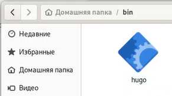{ #fig:2 }

Сделаем клон репозитория для будущего сайта.

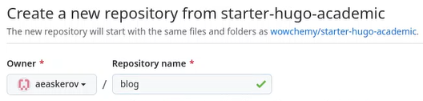{ #fig:3 }

Клонируем репозиторий на устройство.

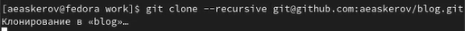{ #fig:4 }

Перейдём в каталог blog и посмотрим на загрузившиеся файлы.

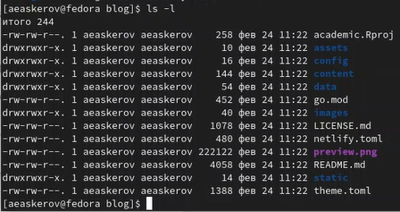{ #fig:5 }

Теперь выполним файл hugo.

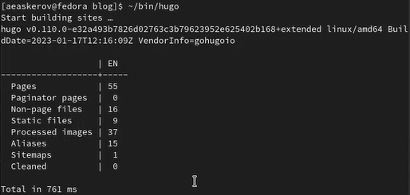{ #fig:6 }

Удалим создавшийся каталог public.

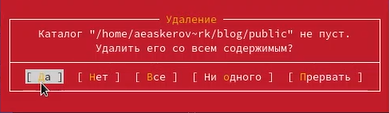{ #fig:7 }

Выполним команду ~/bin/hugo server, после чего откроем страничку нашего сайта, пока что локального.

{ #fig:8 }

Открываем наш сайт.

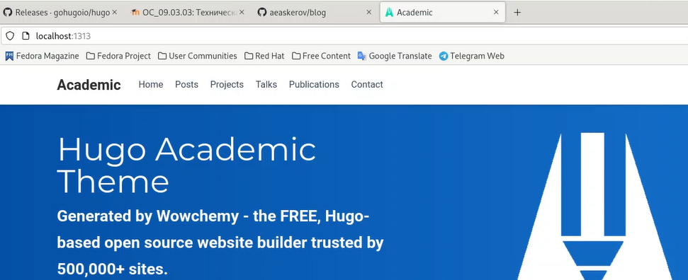{ #fig:9 }

Создадим репозиторий для нашего сайта.

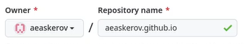{ #fig:10 }

Клонируем на устройстве репозиторий для сайта рядом с каталогом blog.

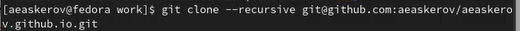{ #fig:11 }

Переключимся на ветку main.

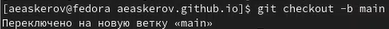{ #fig:12 }

Создадим файл README.md, чтобы активировать репозиторий.

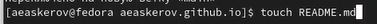{ #fig:13 }

Загрузим новые файлы на GitHub.

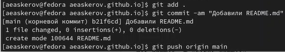{ #fig:14 }

Выполним команду, которая подключит новый репозиторий к каталогу public внутри каталога blog.

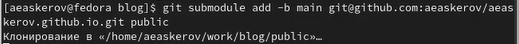{ #fig:15 }

Отредактируем файл .gitignore, закомментировав строчку public/,чтобы избавиться от ошибки. Удостоверимся в выполнении внесённых изменений.

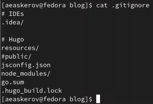{ #fig:16 }

Повторно выполним команду, которая подключит новый репозиторий к каталогу public внутри каталога blog.

{ #fig:17 }

Теперь всё, что будет добавляться в папку public, будет показываться в репозитории сайта.

Находясь в каталоге blog, выполним команду ~/bin/hugo, чтобы обновить файлы в каталоге.

{ #fig:18 }

После этой команды в каталоге появились файлы для нашего сайта.

Убедимся, что каталог подключён к репозиторию.

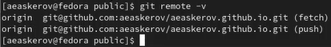{ #fig:19 }

Теперь синхронизируем файлы с репозиторием. Перейдём в каталог public. И введём команды git add, git commit –am, git push.

Обновим страницу репозитория на сайте GitHub и убедимся, что всё отображается.

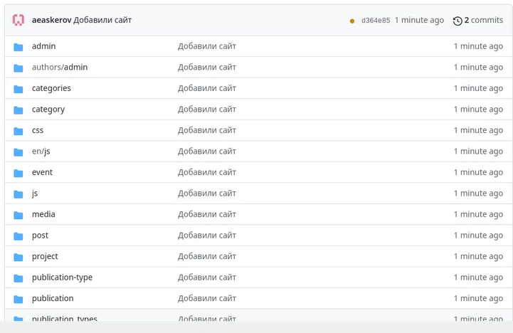{ #fig:20 }

Посмотрим, загрузится ли наш сайт в интернете, если ввести его адрес в адресную строку. Видим, что всё отображается.

{ #fig:21 }

# Выводы

Был приобретён навык размещения на Github pages заготовки для персонального сайта.
